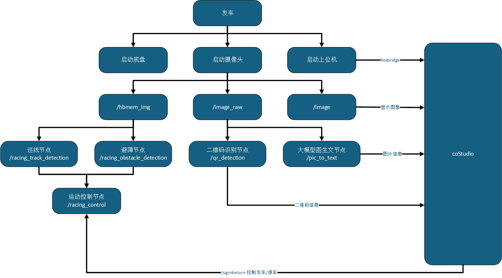
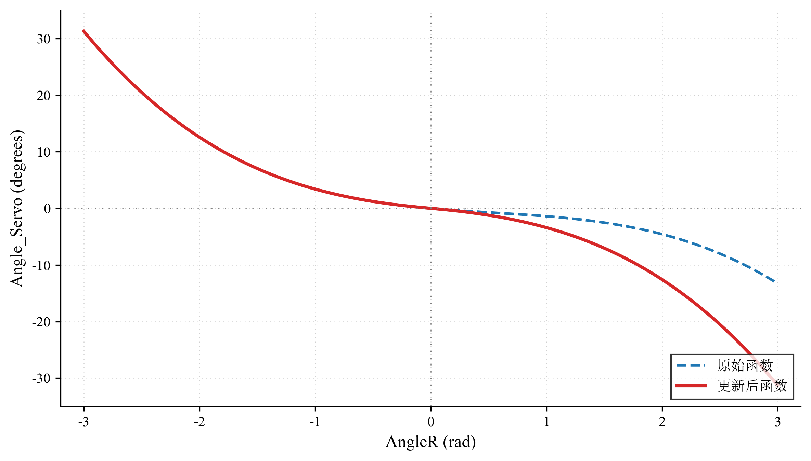
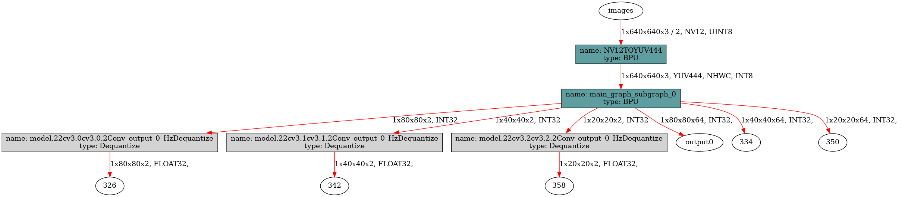

## 摘要

针对第二十届智能车竞赛创意组（地瓜机器人）任务，基于地平线旭日 RDK X5 开发板的 Origin Car Pro 车模，本报告提出了一套高性能自主驾驶系统。系统以单目摄像头为唯一外部传感器，其核心是一种创新的多任务学习端到端控制模型。该模型在单一网络中集成了用于赛道中线预测的 ResNet-18 分支和用于锥桶/停车标志识别的 YOLO11n 分支，并由地平线 BPU 高效加速。该方案实现了从自主巡线、扫描二维码到终点精准停车的全流程闭环控制。经测试，系统平均圈速达 35秒，展现出卓越的鲁棒性。算法层面，ResNet-18 与 YOLO11n 的量化后模型余弦相似度分别高达 99.86% 和 99.97%，在确保高精度的同时，验证了本端到端方案在提升决策实时性与准确性方面的显著优势。

---

## 目录

- [引言](#引言)
  - [任务目标](#任务目标)
  - [系统总体方案概述](#系统总体方案概述)
  - [结构安排](#结构安排)
- [控制算法实现](#控制算法实现)
- [感知算法](#感知算法)
  - [基于 ResNet-18 的中线循迹](#基于-resnet-18-的中线循迹)
  - [基于 YOLO11 的障碍物、终点检测](#基于-yolo11-的障碍物终点检测)
  - [基于 PyZbar 的二维码识别](#基于-pyzbar-的二维码识别)
  - [基于 Google Gemma3 的图生文](#基于-google-gemma3-的图生文)
- [决策规划](#决策规划)
- [性能分析](#性能分析)
  - [赛道中线预测算法性能](#赛道中线预测算法性能)
  - [目标检测算法性能](#目标检测算法性能)
  - [系统整体性能](#系统整体性能)
- [结论](#结论)

---

## 引言

### 任务目标

根据第二十届全国大学生智能车竞赛创意组（地瓜机器人）的赛项要求，该系统的总体目标是在人机协同模式下，以最短的总时间高效、稳定地完成卫生消杀、巡检与信息采集的综合性任务。为实现上述目标，本系统需要完成以下三个核心子任务：

1. **自主任务领取：** 机器人需能够从指定发车点（P）出发，通过自主导航算法，精准、稳定地行驶至区域A内的任务发布点，成功获取并解析指定的二维码，完成任务1。

2. **遥控巡检与消毒：** 系统需无缝切换至遥操作模式，由操作员进行远程控制，根据任务指令规定的路线，在诊疗区内完成巡航，并实时记录沿途病人的状态信息，完成巡检任务后，机器人需准确返回至大厅入口，结束任务2。

3. **自主返航与交付：** 系统需再次切换回自主控制模式，机器人需能够从大厅入口自主规划路径，并安全、快速地返回至区域A的初始停车点（P），实现精准停泊，标志整个任务流程的结束。

综上所述，本系统需要综合运用自主路径规划与导航、环境感知、以及任务状态管理等多项技术，以应对赛项中自主与遥控模式的动态切换，并最终在速度和稳定性上取得优异表现。

### 系统总体方案概述

本系统采用基于 ROS 的分布式、模块化软件架构，其总体方案如图 1 所示。系统启动后，车载摄像头作为主要传感器，采集原始图像数据。该数据流被分为三路：一路以地平线特有的 hbmem_img 格式发布，专供需要 BPU 硬件加速的高性能计算节点使用；一路以通用的 /image_raw 格式发布，供二维码识别节点和大模型图生文节点订阅；最后一路以压缩画质的 /image 格式发布，减少发布至上位机的数据大小。

其中， 巡线节点（ /racing_track_detection ）和避障节点（ /racing_obstacle_detection ）订阅高性能的 hbmem_img 图像流，利用 BPU 进行加速推理，实时解算出赛道线信息和障碍物位置。二维码识别节点（ /qr_detection ）和大模型图生文节点（ /pic_to_text ）订阅原始图像流，分别负责识别场内二维码和解析特定图像信息，完成识别二维码和图生文任务。运动控制节点（ /racing_control ）作为决策与控制核心，订阅并融合来自巡线和避障节点的感知结果，通过内置的 PID 控制算法生成最终的转向和速度指令，驱动底盘运动，形成自主导航的闭环。coStudio 作为上位机监控界面，通过 Rosbridge 与车载系统通信。它不仅能实时显示摄像头图像、二维码及图片信息，还可以通过sign4return信号控制机器人的启动与停车，实现人机协同作业。

### 结构安排

本技术报告旨在系统性地阐述我们为完成竞赛任务所进行的全流程工作。报告首先在引言部分明确系统目标，概述总体技术方案与报告结构。核心章节将深入阐述基于 ROS 的模块化软件架构，详解巡线、避障、二维码识别、图生文、停车等关键感知节点的算法原理与模型部署，以及运动控制节点中控制逻辑的设计实现。随后，报告将重点展示方案的技术亮点与核心创新，特别是我团队提出的基于多任务学习的端到端控制模型，并分析其在提升决策实时性与准确性方面的优势。为验证系统性能，我们提供包括模型精度、量化性能及赛道圈速在内的详尽测试数据，以此对系统的有效性与鲁棒性进行定量与定性分析。最后，报告将对全部工作进行总结，重申成果贡献，客观分析当前方案的不足，并对未来优化方向进行展望，以期全面清晰地展现我们在本届智能车竞赛中的技术探索与实践成果。

---

## 控制算法实现

此代码库构建了一个多功能机器人平台的核心控制算法，其设计围绕 FreeRTOS ，以高频次精确地驱动和管理机器人的运动。整个控制系统以 Balance_task 任务为核心，该任务以100Hz的频率运行，确保了对机器人姿态和速度的实时控制。在每个控制周期中，系统首先读取并处理来自各电机编码器的原始数据，这些数据经过极性校正和单位转换，为后续的速度闭环控制提供了精确的实时反馈。

命令输入层允许机器人通过 CAN 总线接收运动指令，CAN总线直接传入的三轴目标速度。这些输入模块不仅解析原始指令，还会进行必要的死区处理、数据映射和单位转换，将不同控制器的输入统一转化为机器人 X、Y 方向上的线速度和Z轴上的角速度，并最终传递给运动学解算模块。

在每个控制周期中，控制流程会优先处理输入指令中 Vz 的含义。不同于麦克纳姆轮或全向轮小车中 Vz 直接代表车辆的旋转角速度，对于阿克曼车，它被重新定义为前轮的期望转向角度。进入 Drive_Motor() 函数后，阿克曼模式下的运动学逆解逻辑被激活。此时，输入的 Vx 代表车辆的纵向速度，而经过预处理的 Vz 则用于计算前轮的转向。首先，AngleR 会确保转向角度在物理可行且安全的范围内，基于这个转向角度、车辆的轴距和轮距，系统会计算出车辆的瞬时转弯半径，这一步运用了阿克曼转向几何的核心原理：

$$
R = \frac{\text{Axle\_spacing}}{\tan(\text{AngleR})} - 0.5f \cdot \text{Wheel\_spacing}
$$

接下来，根据整体纵向速度和计算出的转弯半径，左右两个驱动轮的目标速度会被精确分解。当 AngleR 非零时，左右轮的目标速度会存在差异，内侧车轮需保持较低速度，外侧车轮则需保持较高速度，以实现平滑的差速转弯。若 AngleR 为零（直行），则两驱动轮的目标速度均简单地等于 Vx。阿克曼小车的另一个关键特性是其前轮的转向通过一个舵机实现。Drive_Motor() 函数在这里承担了驱动舵机的任务，它通过一个预定义的非线性多项式函数将计算出的 AngleR 转换为舵机的实际控制角度值（ Angle_Servo ），进而与 SERVO_INIT 以及一个比例因子结合，生成最终的舵机 PWM 值。在原始的函数定义中，当 AngleR > 0 时， Angle_Servo 的计算公式为：

$$
\text{Angle\_Servo} = -0.628 \cdot \text{AngleR}^3 + \text{AngleR}^2 - 1.772 \cdot \text{AngleR}
$$

但该图像的整体曲线不完全关于原点对称。这种不对称性可能导致左右转向角度不一致，为了修正这一问题，我们对多项式函数进行了调整，将二次项的符号由正号调整为负号，更新后的公式（当 AngleR > 0 时）变为：

$$
\text{Angle\_Servo} = -0.628 \cdot \text{AngleR}^3 - \text{AngleR}^2 - 1.772 \cdot \text{AngleR}
$$

这一改变使得函数在 AngleR 的整个有效范围内呈现出更强的奇函数特性，如图 2 所示。新的曲线消除了原函数在正数区域的局部非线性特征，使得 Angle_Servo 随 AngleR 的增减而更加单调、平稳地变化。这种单调性和对称性确保了无论车辆向左或向右转动相同的角度，舵机的响应都能保持一致。得到左右驱动轮的目标速度后，系统进入速度闭环控制阶段。Incremental_PI_A 和 Incremental_PI_B 这两个独立的增量式 PI 控制器被调用，它们分别负责两个电机的速度控制。每个 PI 控制器会持续地获取对应驱动轮来自编码器的实时速度反馈，并与 Drive_Motor() 计算出的目标速度进行比较，生成速度偏差。然后，基于比例和积分项，计算出驱动电机所需的 PWM 增量。这些增量累加到当前的 PWM 输出值上，驱动电机调整其转速，力求使实际速度紧密地跟踪目标速度，从而实现对阿克曼小车精确的直线行驶和转弯控制。

最后，Set_Pwm() 函数负责将最终计算出的 PWM 值下发至硬件。对于阿克曼小车，它会将 MOTOR_A.Motor_Pwm 和 MOTOR_B.Motor_Pwm 经过正反转逻辑处理后输出给相应的 PWM 通道，同时将之前计算好的舵机PWM值 Servo 直接赋给 Servo_PWM 寄存器，完成对前轮转向的控制。而 MOTOR_C 和 MOTOR_D 的PWM输出则被设置为固定的非驱动值。此外，整个系统通用的安全机制也集成到阿克曼小车的控制中。Turn_Off() 函数能够实时监控电池电压和使能开关状态，在异常情况下立即停止所有电机 PWM 输出。而 robot_mode_check() 函数则作为一道额外的保险，持续监测驱动轮的PWM输出，一旦发现连续的异常大PWM值，便判断为"狂转"并紧急停机，进一步保障了阿克曼小车的运行安全。

---

## 感知算法

### 基于 ResNet-18 的中线循迹

中线循迹的核心感知算法采用了一个基于 ResNet-18 深度学习模型的方案，以实现对赛道中线的精准循迹。该算法可持续处理输入的图像流，并输出赛道中心点的坐标和置信度，为后续的决策与控制模块提供关键依据。在具体的算法流程中，系统首先对车载摄像头传入的原始图像（640x480）进行预处理。为了专注于车辆前方的关键区域并满足模型对输入尺寸的要求，算法会从原始图像的底部裁剪出一个640x224像素的感兴趣区域（ ROI ）。这一裁剪操作能够有效地排除了地平线以上等无关信息的干扰。随后，该裁剪后的图像被缩放至224x224像素，并转换为适用于硬件加速推理的NV12格式，作为ResNet-18模型的最终输入。

经过优化的 ResNet-18 模型在地平线 BPU 的嵌入式计算平台上执行前向推理。传统循迹算法采用的是单一输出预测中线点的归一化坐标（x，y），在一些中线点低置信度情况下可能输出错误的预测坐标，而本模型的输出包含了预测的中线点的归一化坐标（x，y）以及一个置信度值，可以有效避免在后续决策中得到错误的预测坐标而发生无法正确巡线的状况。在后处理阶段，算法首先通过 Sigmoid 激活函数将模型的原始置信度输出转换为0到1之间的概率值。接着，它对归一化的坐标点进行反归一化计算，将其从模型的输出空间 [-1, 1] 还原至裁剪区域（640x224）的像素坐标系。最后，通过将Y坐标加上裁剪时的垂直偏移量，该点被精确地映射回原始图像的完整坐标系中。最终，包含这个中心点坐标和置信度的感知结果被封装成 PerceptionTargets 的消息进行发布，实现了从图像到赛道中线位置的端到端感知。此外，该算法还设计了外部开关，可通过订阅特定 ROS 话题来动态启用或禁用循迹功能，增强了系统的灵活性和可控性。

### 基于 YOLO11 的障碍物、终点检测

在感知算法中，基于 YOLO11 的障碍物与终点线检测是确保安全与完成比赛任务的核心环节。该算法库通过高效的深度学习模型和优化的处理流程，实现了在嵌入式硬件上对赛道环境的实时、精准感知。整个流程从图像数据采集、预处理，到模型推理，再到后处理与结果发布，构成了一个完整且高效的检测系统。该系统的核心是经过优化的 YOLO11 模型，该模型以其在速度和精度上的出色平衡性而被选用，同时也可向下兼容 YOLOv8 系列的检测模型。

为了将高性能的 YOLO11 模型部署到嵌入式设备上，我们进行了一系列离线处理。初始的 PyTorch 模型首先经过结构性调整，主要修改了其 Attention 类和检测头的 forward 方法，将原本混合输出的预测结果分解为独立的分类和边界框信息流，形成了六个独立的输出张量，去除了一些无用的数据搬运操作，同时将Reduce 的维度变为 BCHW 中的 C 维度，对 BPU 更加友好，可以将 BPU 吞吐量翻倍，并且不需要重新训练模型。修改后的模型被导出为通用的 ONNX 格式。随后，我们采用了训练后量化（ PTQ ）方案，利用少量校准数据集，通过地平线的 Open Explorer 工具链将模型从 FP32 运算转换为 INT8 运算。这一步显著降低了模型的计算复杂度和内存占用。在此基础上，我们还进行了一项优化：使用 hb_model_modifier 工具移除了三个边界框输出头的反量化节点，模型架构如图 3 所示，编译后的最终模型将直接输出整型的边界框预测原始值，而反量化所需的缩放系数则作为元数据存储在模型内部，交由运行时的后处理代码进行手动解码。这种设计避免了在 BPU 上执行额外的反量化操作，进一步压榨了硬件性能，使得整个模型在BPU上以单一且高效的计算图运行。

在接收到原始图像数据后，系统首先进行预处理，为了适应 YOLO11 模型固定的输入尺寸（640x640），采用了 letterbox 技术对图像进行缩放和填充。该方法能够在不扭曲图像内容的前提下，将原始图像调整至目标尺寸，保持了原始图像的长宽比，这对于维持物体形态、保证检测精度至关重要。同时，填充区域也使得后续从模型输出坐标到原始图像坐标的反算过程更为简便。

预处理后的图像数据被送入 BPU 进行模型推理。推理完成后，进入后处理阶段，这一阶段的目标是将在三个不同尺度特征图上得到的原始预测解码为有意义的边界框。处理过程首先通过计算反函数并利用其单调性，高效地过滤掉大量置信度低于预设阈值的预测。对于通过初步筛选的预测，系统会进一步进行分布式焦点损失的解码计算，将模型输出的概率分布转换为精确的边界框坐标。完成坐标解码后，系统会对每个检测类别独立执行非极大值抑制算法。 NMS 通过计算候选框之间的交并比，有效剔除了对同一目标的冗余、重叠的检测框，最终为每个被检测到的物体保留一个最优的边界框。 在完成 NMS 后，系统会将最终检测结果的坐标从模型输入尺寸转换回原始图像尺寸，从而得到障碍物或停车标志在摄像机原始视野中的精确位置。

最后，整个检测流程被封装在 ROS 节点中，该节点通过订阅图像话题来获取实时视频流，在每帧图像上执行上述完整的检测流程，并将最终识别出的障碍物和停车标志的位置、类别及置信度信息，以自定义的 PerceptionTargets 消息格式发布出去，供决策和控制模块使用。

### 基于 PyZbar 的二维码识别

为了通过任务发布点的二维码获得信息，我们基于 OpenCV 的图像处理及配套的开源 PyZbar 库，实现了二维码的动态识别与信息转换。由于该任务是子任务一中的一个小目标，需要匹配其他通信接口。在这个部分代码内通过订阅话题获取二维码识别节点是否激活的指令，同时在识别后反馈信号，实现识别完成后的小车巡线状态的暂停。最关键的图像处理部分是通过接收相机节点发布的 /image 信息后，通过 ROS 内置的转换库，将图像交由 OpenCV 处理，配合 PyZbar 库即时处理二维码信息，得到小车进入任务二的运动方向指令。最后，通过 ROS 话题通信实现与数字环境的即时通信。

### 基于 Google Gemma3 的图生文

该部分实现了一个基于 ROS 的图生文算法节点，其核心功能是利用 Google 的 Gemma3 多模态模型，将接收到的图像转换为详细的文本描述。该节点订阅了名为/image_compressed的压缩图像话题，旨在接收来自机器人或其他视觉传感器发布的图像数据。在接收到图像后，节点会利用 CvBridge 和 OpenCV 库，将压缩图像消息解码为可在 Python 中处理的 OpenCV 图像格式。为了与 Google Gemma3 API 的接口规范兼容，解码后的图像会被进一步编码为 Base64 字符串。值得注意的是，该节点设计为通过使用线程锁机制来确保只对接收到的第一张图像进行处理，防止资源浪费和重复推理。一旦该图像被锁定并进入处理流程，后续到达的图像将不再被处理。图像的 Base64 编码完成后，节点会通过一个 OpenAI 兼容模式客户端调用 Google Gemma3 模型进行图生文推理。API调用采用非流式模式，这意味着节点将等待模型返回完整的文本描述，而非逐字接收，从而提高结果获取的即时性和完整性。成功获取到模型返回的文本描述后，节点会通过 ROS 日志系统输出完整回复。完成文本输出后，节点会启动一个定时器，并在短暂延迟后触发 shutdown_node 方法，实现资源的释放与自动退出，在完成单次图像处理任务后便关闭节点。

---

## 决策规划

控制逻辑算法的核心在于一个围绕状态机构建的决策规划系统，旨在使竞赛车辆能够在动态环境中自主导航。整个系统运行在一个独立的线程 MessageProcess 中，持续处理来自感知模块的车道线和障碍物信息，并据此决定车辆的行动策略。

决策规划的层次结构是其设计的关键所在，最高优先级的决策是车辆的停靠指令。系统会持续监测停车标志。一旦检测到停车标志的置信度达到预设的阈值，并且其图像底部 Y 坐标超过了停车阈值，车辆会立即进入 PARKED 状态，并发布一个停止命令，确保精确停靠。如果停车条件尚未触发，系统会进一步评估是否存在障碍物。代码中定义了两个不同的障碍物接近阈值：谨慎区和避障区，当锥桶障碍物以足够高的置信度被检测到，并且其图像底部Y坐标达到或超过避障阈值时，车辆状态会立即切换到 OBSTACLE_AVOIDING 状态机。在此避障模式下，控制逻辑将计算一个基于障碍物与动态参考点之间横向偏差的角速度，以引导车辆绕开障碍物。值得注意的是，该参考点并非固定在图像中心，而是动态选择的：它首先优先考虑高置信度的可见停车标志，其次是高置信度的赛道中心线，只有在两者均不明确的情况下，才会默认使用图像中心作为参考。这种自适应参考点的策略有助于在避障期间仍能保持对赛道或终点目标的感知和规划。为了确保避障方向的一致性，系统会记录上一次避障的转弯方向，并在必要时倾向于保持或强化该方向。当车辆成功避开障碍物，即障碍物不再位于避障区域内时，系统会确定下一步状态。它首先检查赛道线或停车标志是否已再次清晰可见，如果任一主目标（赛道线或停车标志）被检测到，车辆会平稳地返回到 LINE_FOLLOWING 状态。然而，如果避障后失去了对赛道主目标的感知，系统将进入 RECOVERING_LINE 状态。在此恢复模式下，车辆以设定的速度前进，并执行一个与上次避障方向相反的转弯，主动探索并寻找丢失的赛道线或标志，以重新建立定位。

LINE_FOLLOWING 是车辆主要的巡航模式。在此模式下，车辆主要任务是沿着检测到的赛道中心线行进。但在巡线过程中，它会持续监测障碍物。如果发现障碍物进入了谨慎区但尚未达到避障阈值，车辆会预防性地将其线速度降低以示警，但仍会尝试跟随赛道线。巡线转向逻辑是基于赛道中心点相对于图像中心的横向偏差来计算角速度的，这个角速度会根据目标的垂直位置进行调整，以实现更精准的转弯。如果当前帧没有检测到有效的赛道线或停车标志，系统将尝试复用上次的有效控制指令以维持惯性，如果连历史指令都没有，则会以设定的速度慢速直行，避免不稳定的动作。

此外，该系统还包含一个外部手动控制接口，通过订阅 /sign4return ROS话题，当接收到特定的整数值 5 时，ROS节点会挂起自身，车辆立即停止并保持静止，这提供了紧急停止或手动接管的能力。而接收到另一个特定值 6 则可恢复控制，并将状态机重置为 LINE_FOLLOWING，同时清除旧的指令历史，确保车辆从一个安全且可预测的状态开始重新自主运行。

---

## 性能分析

### 赛道中线预测算法性能

为精确实现赛道中线预测任务，我们对 ResNet-18、ResNet-50 和 MobileNetV2 等多种深度学习模型进行了详尽的对比评估，如表 1 所示。

**表 1：赛道中线预测模型性能对比**

| 模型        | 参数量 (M) | 浮点精度 (%) | 量化精度 (%) | 量化后模型余弦相似度(%) | BPU 延迟 (ms) | BPU 吞吐量 (fps) | 后处理时间 (ms) | 总感知延迟 (ms) |
| ----------- | ---------- | ------------ | ------------ | ----------------------- | ------------- | ---------------- | --------------- | --------------- |
| ResNet-18   | 11.27      | 71.49        | 70.50        | 99.86%                  | 2.95          | 448.79           | 0.5             | 3.45            |
| ResNet-50   | 23.51      | 76.25        | 76.00        | 99.75%                  | 5.89          | 189.61           | 0.6             | 6.49            |
| MobileNetV2 | 3.44       | 72.00        | 68.17        | 99.80%                  | 1.42          | 1152.07          | 0.4             | 1.82            |

所有模型统一采用 224x224 作为输入尺寸，并在地平线旭日 RDK X5 的 BPU 上进行了性能测试。从浮点精度来看，ResNet-50 凭借 76.25% 的表现位居榜首，ResNet-18 和 MobileNetV2 分别达到了 71.49% 和 72.0%。然而，在经过训练后量化（PTQ）并转换为 INT8 运算后，MobileNetV2 的精度下降相对明显，从 72.0% 降至 68.17%，而 ResNet-18 和 ResNet-50 的量化精度损失极小，分别保持在 70.50% 和 76.00%，其量化后模型余弦相似度均维持在 99% 以上，这表明 ResNet 系列在量化稳健性上表现更为出色。在实时性方面，BPU 推理延迟是关键指标。MobileNetV2 展现出惊人的速度，总感知延迟为 1.82ms，吞吐量高达 1152.07 fps，紧随其后的是 ResNet-18，总感知延迟为 3.45ms，吞吐量达到 448.79 fps。相比之下，ResNet-50 的延迟显著增加，总感知延迟高达 6.49ms，这在对实时性要求极高的智能车竞赛中可能会成为瓶颈。综合评估后，我们最终选择 ResNet-18 作为赛道中线预测的核心模型，其最主要的原因在于地平线官方量化工具链对其支持度极好，这确保了模型在从浮点到 INT8 转换过程中能够高效稳定地部署，并最大限度地保留原始精度。此外，ResNet-18 在精度与实时性之间达成了平衡，其提供了足以满足竞赛需求的预测精度，同时其 3.45ms 的总感知延迟确保了极高的帧率，足以实时反馈赛道信息。虽然 MobileNetV2 速度更快，但考虑到其量化后精度相对下降，且 ResNet-18 的速度已绰绰有余，我们优先选择了精度更可靠的方案。而 ResNet-50 尽管带来了微小的精度提升，但其翻倍的推理延迟将对整体系统闭环频率造成显著影响，因此并非最优解。ResNet-18 以其高效稳定的性能和对工具链的良好兼容性，成为我们此次赛道中线预测任务的最佳选择。

### 目标检测算法性能

我们对不同 YOLO 系列模型在旭日 RDK X5 上的部署性能进行了严格测试，包括浮点精度、量化精度、BPU 推理延迟及吞吐量，详见表 2 所示：

**表 2：目标检测模型性能对比**

| 模型    | 参数量(M) | 浮点精度 (mAP@50-95) | 量化精度 (mAP@50-95) | 量化后模型余弦相似度(%) | BPU 延迟 (ms) | BPU 吞吐量 (fps) | 后处理时间 (ms) | 总感知延迟 (ms) |
| ------- | --------- | -------------------- | -------------------- | ----------------------- | ------------- | ---------------- | --------------- | --------------- |
| YOLO11n | 2.6       | 0.323                | 0.310                | 99.97                   | 6.8           | 145.8            | 6               | 12.8            |
| YOLOv8n | 3.2       | 0.306                | 0.294                | 98.68                   | 5.2           | 190.1            | 5               | 10.2            |
| YOLOv5n | 1.9       | 0.280                | 0.267                | 99.25                   | 8.1           | 122.7            | 2.3             | 10.4            |

尽管 YOLOv8n 在 BPU 上的推理速度最快，但考虑到 YOLO11n 在参数量适中的情况下提供了最高的浮点精度，并且其经过定制优化后的量化精度损失极小，这使得 YOLO11n 在保证高精度的同时，仍能满足实时性要求。因此，我们最终选择了 YOLO11n 作为主要的障碍物和终点线检测模型。从浮点精度与量化精度的对比可以看出，通过地平线 Open Explorer 工具链进行的 PTQ 量化，对模型的精度影响微乎其微。YOLO11n 的量化后模型余弦相似度高达 99.97%，进一步印证了量化后的模型在保持原始特征表示能力方面的卓越性能。

### 系统整体性能

本系统的整体性能，通过其高效的感知-决策-控制闭环以及出色的鲁棒性得到充分体现。在实时性方面，核心的感知模块 ResNet-18 和 YOLO11n 分别提供 3.45ms 和 12.8ms 的总感知延迟，由于两者可并行计算，主要瓶颈由 YOLO11n 决定。即便如此，该视觉感知管线能够以高帧率稳定向决策层输送数据，结合底层 100Hz 的控制周期，整个闭环能够稳定以摄像头的帧率 60 FPS 运行，确保了车辆对赛道环境的实时、精确响应。虽然二维码识别和端侧图生文服务耗时相对较长，但由于它们属于间歇性且非实时性的任务，并不会阻碍核心控制循环的高频运行。这种高效的实时性能直接转化为卓越的赛道表现，在多次实际测试中，本系统能够稳定实现平均 35 秒的单圈用时，充分证明了其在高速自主巡线、精准障碍物规避、任务模式快速切换以及终点精准停车方面的综合效率。

除了速度，系统的鲁棒性是其能够在复杂竞赛环境中稳定运行的关键，这主要归功于几个核心设计。首先，状态机使得车辆能在不同赛道情况和任务阶段之间实现平滑且逻辑清晰的切换。其次，在避障过程中引入动态参考点，优先考量停车标志或赛道线，以及在感知暂时丢失时采用惯性前进或反向探索等容错机制，显著增强了系统在复杂场景下的自恢复能力。此外，精确调优的阿克曼运动学逆解和经过修正的舵机角度映射函数提升了车辆转向的精度和可预测性。最后，集成的电压监控和狂转检测等多重安全机制，进一步保障了车辆在运行过程中的安全性和可靠性。

---

## 结论

本技术报告详细阐述了为第二十届智能车竞赛创意组（地瓜机器人）任务设计并实现的高性能自主驾驶系统。该系统以地平线旭日 RDK X5 开发板上的 Origin Car Pro 车模为载体，并以单目摄像头作为核心外部传感器，成功应对了竞赛中涉及的自主巡线、二维码识别、图生文、障碍物避让及终点精准停车等一系列复杂任务挑战。其核心亮点在于创新性地融合了基于多任务学习的端到端控制模型，该模型在一个单一网络中集成了用于赛道中线预测的 ResNet-18 分支和用于锥桶/停车标志识别的 YOLO11n 分支，极大地提升了决策的实时性与准确性，并在地平线 BPU 上实现了高效的实时推理。整个系统基于 ROS 框架构建，各模块高度解耦，确保了良好的可扩展性与鲁棒性，在实际测试中展现出平均 35 秒的圈速。

具体而言，本系统凭借 ROS 框架的模块化设计，实现了感知、决策与控制的高度解耦与协同。核心感知算法中，优选 ResNet-18 模型用于赛道中线预测，以及 YOLO11n 模型用于障碍物与终点标志检测，两者均通过地平线 BPU 进行了深度优化与高效量化，实测 ResNet-18 的量化后模型余弦相似度高达 99.86%，YOLO11n 更达 99.97%。这些优化确保了极低的感知延迟和高精度输出，验证了本端到端方案在提升决策实时性与准确性方面的显著优势。在此基础上，精密的阿克曼运动学逆解、修正后的舵机角度映射函数以及健壮的状态机决策逻辑，共同构建了车辆精准的循迹、灵活的避障和稳定的停车能力，使系统能够自如地在自主巡线、扫描二维码、终点停车及遥控巡检等多种模式间无缝切换。

尽管当前系统已在竞赛中展现出令人满意的性能和鲁棒性，但仍存在进一步优化的空间。未来的工作可以尝试引入更多传感器模态，如车模上搭载的深度相机，以增强环境感知能力，弥补纯单目摄像头方案的深度信息缺失。更进一步地，为了实现更加智能和鲁棒的全局路径规划，未来我们考虑将当前独立运行的 ResNet 中线预测与 YOLO 目标检测模型，整合并统一为一个基于语义分割的 YOLO 模型。语义分割能够提供像素级的环境理解，例如精确识别可行驶区域、赛道边界和障碍物边缘，从而为车辆进行更加精细和实时的全局路径规划提供丰富的几何信息。这种更精细的感知能力将有助于探索更高层次的全局路径规划与局部避障相结合的策略，例如基于地图的导航或强化学习辅助的决策，同时，也可考虑将简单的图生文服务任务，经过模型裁剪和量化后部署至边缘端，以降低对网络依赖和提升响应速度，从而在不增加复杂性的情况下，进一步提升地瓜机器人在未来更广泛应用场景中的自主导航能力和任务完成效率。
