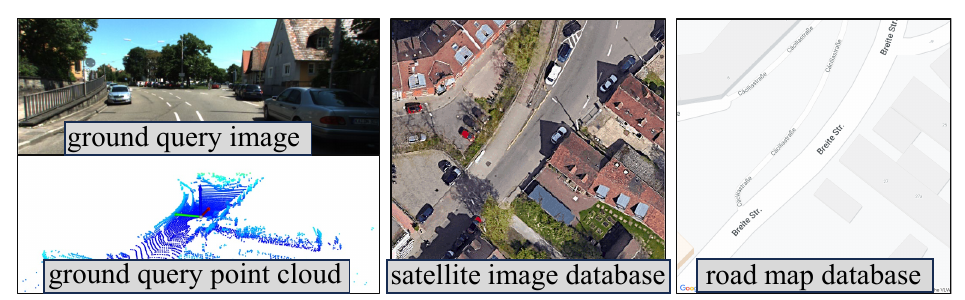
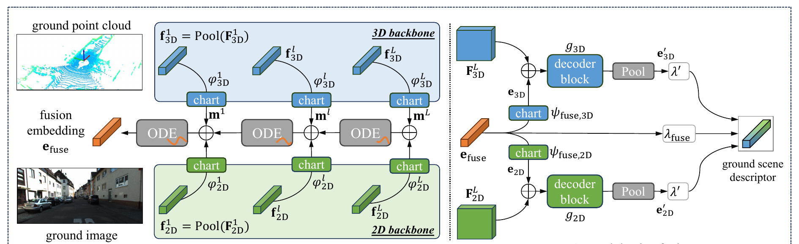
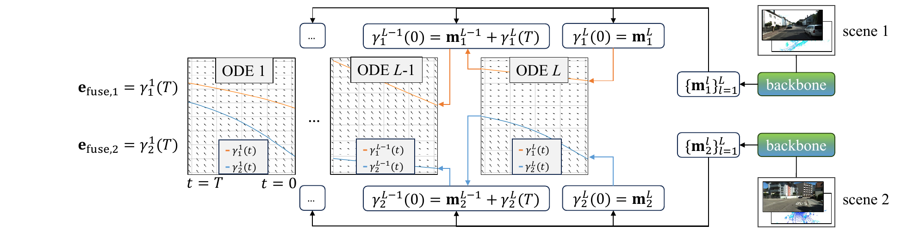

> [!NOTE] 论文信息
> **Multi-Modal Aerial-Ground Cross-View Place Recognition with Neural ODEs**，Sijie Wang、Rui She、Qiyu Kang、Siqi Li、Disheng Li、Tianyu Geng、Shangshu Yu、Wee Peng Tay，CVPR 2025。原文：[CVF Open Access PDF](https://openaccess.thecvf.com/content/CVPR2025/papers/Wang_Multi-Modal_Aerial-Ground_Cross-View_Place_Recognition_with_Neural_ODEs_CVPR_2025_paper.pdf)

AGPlace 研究航拍数据库与地面多传感器观测之间的地点检索：

- 数据库来自航拍视角：卫星 RGB 图或道路语义图；
- 查询来自地面视角：相机图像与 LiDAR 点云；
- 系统要在完全不同的视角和模态之间检索同一地点。

普通 ground-ground place recognition 至少共享视角；常见 aerial-ground 方法又大多只匹配地面图像与航拍图像。AGPlace 首次把地面相机和点云联合起来，再与航拍数据库对齐。

融合时需要兼顾模态之间的互补性和扰动传播，图像提供纹理与语义，点云提供几何信息，但传感器观测会受到光照、遮挡、稀疏性和故障影响。过早强耦合会把一个模态的扰动直接传播到另一个模态，简单 late fusion 又难以学习跨模态互补关系。

论文采用两阶段融合。先在代理流形中用 Neural ODE 从高层到低层更新融合状态，再将其映射回 2D/3D 空间，指导各模态形成最终地点描述子。

_图 1：地面查询由图像与点云组成，航拍数据库可以是卫星图，也可以是道路图_

## Table of contents

## 1. 问题设定：三重差异同时存在

设航拍数据库描述子为：

$$
\mathcal D_A
=
\left\{
\mathbf e_{A_i}
\right\}_{i=1}^{M},
$$

地面查询描述子为：

$$
\mathcal D_G
=
\left\{
\mathbf e_{G_j}
\right\}_{j=1}^{N}.
$$

检索时计算地面查询与所有航拍候选之间的距离，并返回最近位置。论文在主要航拍-地面实验中使用 25 米作为正确检索阈值。

这个任务同时包含三种 domain gap：

1. 视角差异：俯视卫星图与前视地面观测几乎没有直接像素对应；
2. 模态差异：RGB、LiDAR、卫星图和道路图的数据统计完全不同；
3. 信息尺度差异：地面视图关注局部街景，航拍图覆盖更大的道路与建筑布局。

AGPlace 引入 surrogate manifold，让 2D 与 3D 特征通过这一中介空间交换信息，避免直接将所有特征对齐到同一欧氏空间。

## 2. 总体架构：两个方向相反的融合阶段

_图 2：左侧在代理流形中构造融合 embedding，右侧把融合信息映射回各模态空间_

### 2.1 模态专属 backbone

地面图像和点云分别经过 2D、3D backbone。在第 $l$ 个 block 得到特征图：

$$
\mathbf F_{\text{2D}}^l,
\qquad
\mathbf F_{\text{3D}}^l.
$$

全局池化后：

$$
\mathbf f_{\text{2D}}^l
=
\operatorname{Pool}
\left(
\mathbf F_{\text{2D}}^l
\right),
\qquad
\mathbf f_{\text{3D}}^l
=
\operatorname{Pool}
\left(
\mathbf F_{\text{3D}}^l
\right).
$$

作者有意使用 pooled vector 来构造融合状态，因为 place recognition 需要全局场景摘要，而不是像分割或深度估计那样依赖密集局部预测。

### 2.2 Stage 1：从各模态进入融合流形

两个可学习 chart function 把 2D/3D 特征映射到 $C$ 维流形 $\mathcal M^C$：

$$
\mathbf m^l
=
\phi_{\text{2D}}^l
\left(
\mathbf f_{\text{2D}}^l
\right)
+
\phi_{\text{3D}}^l
\left(
\mathbf f_{\text{3D}}^l
\right).
$$

$\mathbf m^l$ 被论文称为 fusion state momentum。它不是最终描述子，而是第 $l$ 层提供给融合动态系统的新观测。

### 2.3 Stage 2：从融合流形返回各模态

得到最终融合 embedding 后，模型再用反向 chart function 映射回 2D 与 3D 空间，注入原始高层特征，分别解码并聚合。这一阶段让共享的全局信息重新指导各模态的局部表示。

两个阶段分别承担以下任务，并为传感器扰动提供补偿路径：

- Stage 1 学习跨模态共有的地点状态；
- Stage 2 保留 2D/3D 的独立表示能力；
- 某个传感器受扰动时，另一个模态与融合状态仍能提供补偿。

## 3. Neural ODE 如何构造融合状态

AGPlace 从最后一个 backbone block $L$ 反向走到第一个 block，按由深到浅的顺序累积融合：

$$
L\rightarrow L-1\rightarrow\cdots\rightarrow1.
$$

在最深层：

$$
\boldsymbol\gamma^L(0)=\mathbf m^L.
$$

在其余层：

$$
\boldsymbol\gamma^l(0)
=
\mathbf m^l
+
\boldsymbol\gamma^{l+1}(T).
$$

也就是说，上一段 ODE 的终点会与当前层特征相加，成为下一段动态系统的初值。

每个 block 中的状态由 Neural ODE 更新：

$$
\frac{
\mathrm d\boldsymbol\gamma^l(t)
}{
\mathrm dt
}
=
f_{\theta_l}
\left(
\boldsymbol\gamma^l(t)
\right).
$$

求解到时间 $T$ 后得到 $\boldsymbol\gamma^l(T)$。最终融合 embedding 为：

$$
\mathbf e_{\text{fuse}}
=
\boldsymbol\gamma^1(T).
$$

_图 3：不同场景从不同初始状态出发，依次经过 $L\rightarrow1$ 的 ODE blocks_

### 3.1 为什么方向是高层到低层

深层特征先提供场景级语义与大尺度结构，随后浅层特征补充纹理和几何细节。消融实验中：

| 融合方向                  | KITTI360-AG Satellite R@1/5/10 |
| ------------------------- | -----------------------------: |
| block $1\rightarrow L$    |             31.7 / 46.8 / 54.0 |
| **block $L\rightarrow1$** |         **32.0 / 47.6 / 54.9** |

差距不大，但支持论文的设计直觉：先建立全局地点状态，再用低层信息逐步细化。

### 3.2 “轨迹不相交”到底保证了什么

论文引用 ODE 解的唯一性：当向量场对状态满足适当的 Lipschitz 条件时，两个不同初值产生的解轨迹不会相交。因此，如果两个场景在某个 block 的初始融合状态不同，经过同一 ODE 后仍会得到不同输出。

这一性质排除了不同初始状态被同一动态系统映射到同一点的情况，但仍有以下限制：

- 它只保证状态不完全相同，不保证检索 margin 足够大；
- 不保证类内样本自然聚拢、类间样本自然分离；
- 检索所需的特征几何仍由 MVMM 与 triplet loss 学习；
- 数值 ODE solver、网络参数化和有限精度也不等于理想连续系统。

Neural ODE 在这里是带有唯一流先验的连续残差更新器。表示是否具有判别性，仍取决于检索损失的训练。

## 4. Stage 2：把共享状态重新注入 2D 与 3D

融合 embedding 分别映射回两个模态：

$$
\begin{aligned}
\mathbf e_{\text{2D}}
&=
\psi_{\text{fuse,2D}}
\left(
\mathbf e_{\text{fuse}}
\right),\\
\mathbf e_{\text{3D}}
&=
\psi_{\text{fuse,3D}}
\left(
\mathbf e_{\text{fuse}}
\right).
\end{aligned}
$$

随后广播加到最后一层特征图，并经过 decoder：

$$
\mathbf e'_{\text{2D}}
=
\operatorname{Pool}
\left[
g_{\text{2D}}
\left(
\mathbf e_{\text{2D}}
\oplus
\mathbf F_{\text{2D}}^L
\right)
\right],
$$

$$
\mathbf e'_{\text{3D}}
=
\operatorname{Pool}
\left[
g_{\text{3D}}
\left(
\mathbf e_{\text{3D}}
\oplus
\mathbf F_{\text{3D}}^L
\right)
\right].
$$

最终地面描述子是三部分的加权和：

$$
\mathbf e_G
=
\lambda'
\left(
\mathbf e'_{\text{2D}}
+
\mathbf e'_{\text{3D}}
\right)
+
\lambda_{\text{fuse}}
\mathbf e_{\text{fuse}}.
$$

Stage 2 的意义是软化 2D 与 3D 的直接耦合。每个模态仍经过自己的 decoder，但都能看到跨模态全局状态；融合表示也单独保留在最终描述子中。

## 5. MVMM Loss：同时对齐视角、模态与模态内部结构

论文把 positive pair 标为 $y_{ij}=0$，negative pair 标为 $y_{ij}=1$。对两个 domain 的 embedding 集合 $\mathcal D_1,\mathcal D_2$，令：

$$
d_{ij}
=
\left\|
\mathbf e_{1i}-\mathbf e_{2j}
\right\|_2.
$$

把 $\sigma(d_{ij})$ 解释为 negative probability，则标准二元交叉熵可以写为：

$$
\begin{aligned}
\mathcal L(\mathcal D_1,\mathcal D_2)
&=
-
\frac{1}{N_1N_2}
\sum_{i,j}\ell_{ij},\\
\ell_{ij}
&=
y_{ij}\log\sigma(d_{ij})\\
&\quad+
(1-y_{ij})
\log\left(1-\sigma(d_{ij})\right).
\end{aligned}
$$

论文式 (13) 展示了括号内的 log-likelihood，但没有在整体前写负号。如果训练目标按常规方式最小化，就需要整体取负，或者等价地最大化原式。仅凭正文无法判断这是符号省略还是实现约定，需要公开实现才能核对。

定义四组描述子：

- $\mathcal D_A$：航拍描述子；
- $\mathcal D_G$：最终地面融合描述子；
- $\mathcal D_{\text{G2D}}$：地面图像分支描述子；
- $\mathcal D_{\text{G3D}}$：地面点云分支描述子。

MVMM Loss 为：

$$
\begin{aligned}
\ell_{\text{MVMM}}
={}&
\mathcal L(\mathcal D_A,\mathcal D_A)\\
&+
\mathcal L(\mathcal D_G,\mathcal D_A\cup\mathcal D_G)\\
&+
\mathcal L(
\mathcal D_{\text{G2D}},
\mathcal D_A\cup\mathcal D_{\text{G2D}}
)\\
&+
\mathcal L(
\mathcal D_{\text{G3D}},
\mathcal D_A\cup\mathcal D_{\text{G3D}}
).
\end{aligned}
$$

除了拉近最终 ground-aerial pair，MVMM 还约束：

- aerial-aerial 内部结构；
- ground-ground 内部结构；
- 2D-aerial 与 3D-aerial 的跨域关系；
- 2D/3D 各自的同域判别能力。

作者再加入带 hard negative mining 的 triplet loss。先记正负航拍匹配距离为：

$$
\begin{aligned}
d_i^p
&=
\left\|
\mathbf e_{G_i}-\mathbf e_{A_i}^{p}
\right\|_2,\\
d_i^n
&=
\left\|
\mathbf e_{G_i}-\mathbf e_{A_i}^{n}
\right\|_2.
\end{aligned}
$$

则：

$$
\ell_{\text{tri}}
=
\frac{1}{N}
\sum_i
\left[
d_i^p-d_i^n+m
\right]_+.
$$

最终目标：

$$
\ell
=
\alpha\ell_{\text{MVMM}}
+
\ell_{\text{tri}}.
$$

MVMM 约束多个域中的绝对距离，triplet 则约束正负样本的相对排序。

## 6. 实验结果与消融应该怎样读

### 6.1 KITTI360-AG：卫星图与道路图都能作为数据库

| 方法        |     Satellite R@1/5/10 |      Road Map R@1/5/10 |
| ----------- | ---------------------: | ---------------------: |
| Lip-Loc     |     29.9 / 42.2 / 49.0 |     24.5 / 35.6 / 42.4 |
| MinkLoc++   |     28.9 / 39.3 / 44.9 |     26.5 / 40.8 / 48.8 |
| UMF         |     27.1 / 42.6 / 49.2 |     25.6 / 40.4 / 49.7 |
| **AGPlace** | **32.0 / 47.6 / 54.9** | **28.2 / 43.3 / 52.0** |

道路图没有纹理和真实外观，仍取得 28.2 R@1。这说明跨视角地点识别可以主要依赖道路拓扑与建筑布局等结构信息，也降低了航拍影像采集成本。

同时融合 satellite 与 road map 后，R@1 进一步达到 34.7，表明航拍侧本身也存在值得研究的多模态互补。

### 6.2 两阶段和 MVMM 都有独立贡献

| 模型        |      R@1 |      R@5 |     R@10 |
| ----------- | -------: | -------: | -------: |
| Full        | **32.0** | **47.6** | **54.9** |
| w/o Stage 1 |     28.5 |     43.9 |     51.0 |
| w/o Stage 2 |     30.6 |     45.3 |     53.0 |
| w/o MVMM    |     30.9 |     45.2 |     51.7 |

去掉 Stage 1 后性能下降最多，代理流形中的融合状态对结果影响较大。Stage 2 和 MVMM 分别负责模态回注与多域几何约束，去掉任一项也会降低表中的三个指标，但降幅较小。

### 6.3 ODE 比 MLP 与 attention 更有效，但增益有限

| 状态更新       |      R@1 |      R@5 |     R@10 |
| -------------- | -------: | -------: | -------: |
| MLP            |     30.0 |     45.2 |     51.9 |
| Attention      |     30.4 |     45.4 |     52.8 |
| **Neural ODE** | **32.0** | **47.6** | **54.9** |

ODE 带来约 1.6 至 2.0 个百分点的 R@1 增益，支持在这套模型中使用连续状态演化。整体结果还依赖 backbone、多域监督和两阶段融合，不能把全部提升归于 ODE。

### 6.4 传感器故障实验说明 Stage 2 的价值

在 nuScenes-AG 上，所有模型都用相机和 LiDAR 训练，再在测试时丢弃一个模态：

| 模型                | 双模态 R@1 | 相机缺失 R@1 | LiDAR 缺失 R@1 |
| ------------------- | ---------: | -----------: | -------------: |
| AGPlace w/o Stage 2 |       73.9 |         19.2 |            6.9 |
| **AGPlace**         |   **75.6** |     **22.8** |       **12.9** |

Stage 2 在 LiDAR 缺失时的效果尤其明显，R@1 从 6.9 提升到 12.9。不过，这仍远低于完整输入的 75.6。“robust to sensor failure”在这里指性能退化有所缓和，模态缺失的影响依然很大。

### 6.5 实时性

论文在 Tesla A100 上报告 62 FPS、0.61 GB GPU memory。显存与其他多模态方法接近，但速度低于部分简单基线，说明 ODE 求解与两阶段融合并非零成本；62 FPS 仍满足实时检索描述子提取的量级需求。

## 7. 局限、可迁移思路与我的结论

### 7.1 数据集仍偏城市道路

论文明确指出，当前 ground queries 主要来自城市环境。森林、乡村、山地、室内或非道路机器人场景能否泛化，尚未验证。道路图在城市中很有信息量，在无结构地形中可能迅速失效。

### 7.2 新任务中的 baseline 适配影响比较公平性

许多对比方法原本为 ground-ground 或单模态检索设计，需要作者接入统一航拍网络与维度对齐头。AGPlace 对新任务天然定制，性能差异既来自融合方法，也可能受 baseline 适配质量影响。

### 7.3 ODE 理论与检索目标之间仍有距离

轨迹不相交只排除了完全状态碰撞，并没有直接优化 Recall。更强的理论分析应连接 ODE flow 的 Lipschitz 性、类内紧致度、类间 margin 与传感器扰动，而论文目前主要依靠消融证明有效。

### 7.4 MVMM 的全 pair 关系成本较高

多个 domain 两两计算距离会随 batch size 平方增长。更大 batch 有利于 hard negative mining，却增加显存与计算。实际扩展到更多地面或航拍模态时，可能需要 memory bank、分块相似度或更有针对性的 pair sampling。

### 7.5 可以迁移的融合设计

我认为可以尝试迁移到其他融合任务的设计包括：

1. 为异构模态保留独立 backbone；
2. 在中介空间中构造共享全局状态；
3. 让共享状态按层级逐步更新，而不是一次 concat；
4. 再把共享状态投回各模态，形成残缺输入下的冗余路径；
5. 用跨域和域内损失共同约束表征几何。

相机-雷达、图像-文本-地图和多传感器时序融合都可以尝试这种结构。Neural ODE 是其中一种状态更新器，提供连续动态与唯一流先验，但也可以比较其他更新方式。

AGPlace 在同一架构中处理了跨视角匹配、跨模态融合和传感器缺失。接下来需要检验的是：换用更多地形、传感器组合或更严格的定位阈值后，代理流形与 ODE 设计还能带来多少收益。

## 参考资料

1. [CVPR 2025 论文原文](https://openaccess.thecvf.com/content/CVPR2025/papers/Wang_Multi-Modal_Aerial-Ground_Cross-View_Place_Recognition_with_Neural_ODEs_CVPR_2025_paper.pdf)
2. [CVF Open Access 页面](https://openaccess.thecvf.com/content/CVPR2025/html/Wang_Multi-Modal_Aerial-Ground_Cross-View_Place_Recognition_with_Neural_ODEs_CVPR_2025_paper.html)
