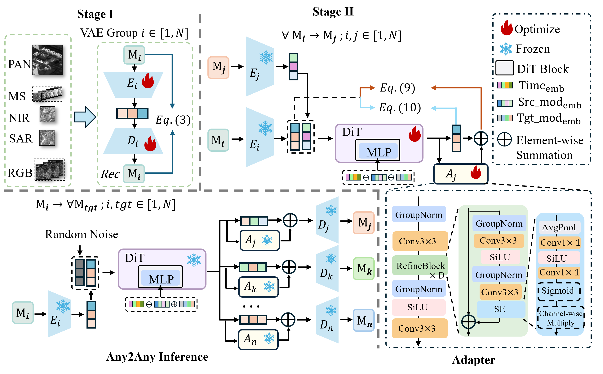
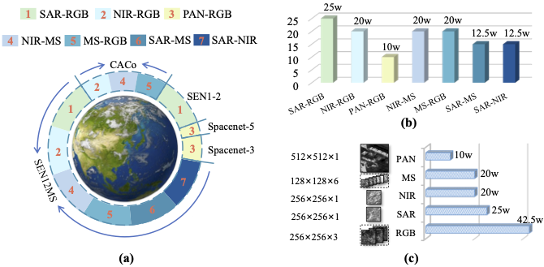
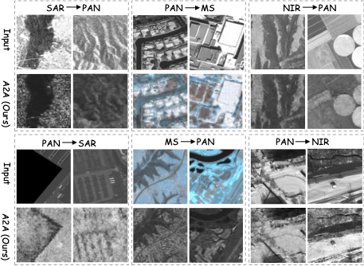

> [!NOTE] 论文信息
> **Any2Any: Unified Arbitrary Modality Translation for Remote Sensing**，Haoyang Chen、Jing Zhang、Hebaixu Wang、Shiqin Wang、Pohsun Huang、Jiayuan Li、Haonan Guo、Di Wang、Zheng Wang、Bo Du，ICML 2026。原文：[arXiv](https://arxiv.org/abs/2603.04114) · [作者代码](https://github.com/MiliLab/Any2Any)。本文的方法与实验解读以 arXiv v2 为准。

同一地点可以被 RGB、SAR、近红外、多光谱和全色传感器观测，但实际数据很少同时具备全部模态。Any2Any 研究如何利用已有观测，生成缺失模态的影像。

传统做法通常把 SAR-to-RGB、RGB-to-NIR 等方向分别当成独立任务。每个方向训练一个模型，短期内容易实现，但模态增多后，模型数量、训练成本和维护负担都会迅速上升；一个方向学到的地理结构，也很难直接帮助另一个方向。

不同传感器记录的是同一地理场景，部分场景结构可以跨模态复用。Any2Any 据此将结构学习与目标模态的表示分开：各模态先进入统一尺寸的潜空间，共享 DiT 根据源模态和目标模态执行条件生成，最后由目标专属残差适配器校准。多个转换方向由此共用一个主干。

_图 1：各模态独立编码，共享 DiT 完成跨模态生成，目标适配器校准后再解码。_

## Table of contents

## 1. 问题设定：Any 指转换方向，不是任意输入组合

设系统包含 $N$ 种遥感模态：

$$
\mathcal S=\{\mathcal M_1,\ldots,\mathcal M_N\}.
$$

任意有方向的跨模态转换可写为：

$$
\mathcal G_{i\rightarrow j}:\mathcal M_i\rightarrow\mathcal M_j,
\qquad i\ne j.
$$

若每个方向单独训练，最多需要 $N(N-1)$ 个转换模型。五种模态对应二十个方向，但这并不意味着我们能为每个方向都收集足够的配对样本。

本文涉及的五种模态分别是：

| 模态 | 名称         | 主要观测信息               |
| ---- | ------------ | -------------------------- |
| RGB  | 可见光       | 颜色、纹理与外观           |
| SAR  | 合成孔径雷达 | 雷达散射响应与地物结构     |
| NIR  | 近红外       | 近红外波段反射信息         |
| MS   | 多光谱       | 多个波段的光谱响应         |
| PAN  | 全色         | 宽波段强度与较细的空间结构 |

Any2Any 每次接收一种源模态，并输出指定的一种目标模态。它不支持同时接收任意数量的传感器输入，也没有将所有模态拼成一个通用输入张量。

零样本转换中的“未见”指训练时没有该源-目标配对。目标模态本身仍参与过训练，各模态也需要自己的编码器、解码器和相关数据。

## 2. RST-1M：监督关系可以稀疏，但要连通

### 2.1 不要求每个地点都有五模态观测

RST-1M 汇集 SEN1-2、SEN12MS、CACo、SpaceNet-3 和 SpaceNet-5 等公开数据，将空间对齐的模态对组织到统一任务中。论文报告约 120 万对跨模态图像，覆盖七种无方向模态配对，也就是十四个有监督转换方向。

剩下的六个方向来自三组缺少配对训练数据的关系：

- SAR 与 PAN；
- MS 与 PAN；
- NIR 与 PAN。

这里的“百万级”不是指百万个地点都具有完整的五模态观测，也不应把图像数、图像对数和独立场景数混为一谈。

_图 2：RST-1M 以部分配对数据连接五种传感模态，并保留不同模态的空间分辨率。_

### 2.2 把数据集看成一张模态关系图

可以把每一种模态看成节点，有配对训练样本的模态之间连一条边。完整五模态观测很难获得，但只要已有边把整张图连接起来，不同方向就有机会通过共享网络交换监督信息。

例如，存在 SAR-RGB 和 RGB-PAN 数据时，模型可以分别学习 SAR、PAN 与光学场景结构的关系，再尝试没有直接配对数据的 SAR-to-PAN。

这不等于推理时必须先生成 RGB、再由 RGB 生成 PAN。Any2Any 在推理时直接指定目标模态，由共享主干执行转换；RGB 主要是训练监督图中的连接节点，而不是每次调用都要经过的中间图像。

### 2.3 相同地面范围，不必使用相同像素尺寸

不同传感器的原始分辨率不同。论文将 PAN 裁为 $512\times512$，RGB、SAR 和 NIR 裁为 $256\times256$，MS 裁为 $128\times128$，随后通过模态专属 VAE 将它们编码为统一的 $4\times64\times64$ 潜变量。

各模态因此可以保留合适的观测尺度，无需先缩放到相同像素尺寸；计算接口在潜空间中统一。

配对图像仍需要正确配准。如果两张图覆盖的地理区域不同，生成模型就会收到矛盾的结构监督。

## 3. 第一阶段：VAE 负责各模态的表示与重建

### 3.1 每种模态有自己的编码器和解码器

对模态 $i$，记编码器为 $E_i$，解码器为 $D_i$：

$$
\mathbf z_i=E_i(\mathbf x_i),
\qquad
\widehat{\mathbf x}_i=D_i(\mathbf z_i).
$$

所有 $\mathbf z_i$ 的形状相同，但输入通道数与空间尺寸可以不同。这样，SAR 的统计特征不必由 RGB 的像素重建分支兼顾，多光谱输出也不需要强行压成三通道图像。

VAE 阶段的目标为：

$$
\begin{aligned}
\mathcal L_{\text{VAE}}
={}&\mathcal L_{\text{rec}}(\mathbf x_i,\widehat{\mathbf x}_i)\\
&+\gamma\mathcal L_{\text{LPIPS}}(\mathbf x_i,\widehat{\mathbf x}_i)\\
&+\beta\mathcal L_{\text{KL}}(\mathbf z_i).
\end{aligned}
$$

三部分分别负责像素重建、感知一致性与潜分布正则化。具体实验使用 $L_2$ 重建损失，RGB 的 $\gamma=1$，其余模态的 $\gamma=0$，各模态的 $\beta=10^{-5}$。

也就是说，面向自然图像的感知损失只用于 RGB。

### 3.2 统一维度不等于语义已经对齐

各 VAE 独立训练，即使都得到 $4\times64\times64$ 张量，并受标准正态先验约束，同一个潜通道也未必表达相同地物。

我将这一阶段理解为统一潜表示的容量、尺度和接口。跨模态关系仍需通过后续成对监督学习，不同 VAE 留下的分布差异则由目标适配器处理。

进入第二阶段后，VAE 参数冻结，避免编码空间一边变化、共享转换网络一边追赶。论文还对各模态潜变量使用专属缩放系数，统一潜变量幅值；只对齐张量形状还不够。

## 4. 第二阶段：共享 DiT 如何学会不同转换方向

### 4.1 Latent Anchor 是配对目标的潜表示

给定空间配准的源图像 $\mathbf x_i$ 和目标图像 $\mathbf x_j$，冻结的目标编码器给出：

$$
\mathbf z_j=E_j(\mathbf x_j).
$$

它就是论文所说的 latent anchor。训练要求生成结果靠近该地点实际配对观测的潜变量，因此监督包含具体的地点对应关系，而不限于目标模态的外观。

论文将这种训练近似写为：

$$
p(\mathbf z\mid\mathbf x_i)
\approx\delta(\mathbf z-\mathbf z_j).
$$

这里应理解为用具体配对目标锚定监督。它不意味着从一张 SAR 图就能在物理上唯一确定 RGB 的所有颜色：配对训练给了一个目标样本，并没有消除传感器之间的信息缺失。

### 4.2 将源潜变量与带噪目标拼接

训练时，先给干净目标潜变量加入噪声：

$$
\begin{aligned}
\mathbf z_t
&=\sqrt{\bar\alpha_t}\mathbf z_j
+\sqrt{1-\bar\alpha_t}\boldsymbol\epsilon,\\
\boldsymbol\epsilon&\sim\mathcal N(0,\mathbf I).
\end{aligned}
$$

源潜变量不参与这一步加噪，而是作为条件，与带噪目标沿通道维拼接：

$$
\mathbf I_t=[\mathbf z_t,\mathbf z_i]
\in\mathbb R^{2c\times h\times w}.
$$

对实际使用的潜变量尺寸，网络输入为 $8\times64\times64$。一半通道表示待去噪状态，另一半通道提供该地点的源观测结构。

### 4.3 用模态标记控制共享主干

相同的源图像可能需要生成不同目标，因此网络必须知道“从什么模态来、要转成什么模态”。论文将时间步、源模态和目标模态 embedding 相加，再经 MLP 得到条件向量：

$$
\mathbf c
=\operatorname{MLP}
\left(\mathbf e_t+\mathbf e_{\text{src}}+\mathbf e_{\text{tgt}}\right).
$$

条件通过 Adaptive Layer Normalization，简称 AdaLN，调制 DiT 特征。共享的是 Transformer 主干，转换方向则由条件控制，不需要为每个方向复制一套大网络。

### 4.4 预测干净潜变量，而不是只预测噪声

Any2Any 采用 $x_0$-prediction，让主干直接输出干净目标潜变量的估计：

$$
\widehat{\mathbf z}_j=f_\theta(\mathbf I_t,\mathbf c).
$$

对应的主要训练损失是：

$$
\mathcal L_{z_0}
=\mathbb E_{\mathbf z_j,\boldsymbol\epsilon,t}
\left[\|\mathbf z_j-f_\theta(\mathbf I_t,\mathbf c)\|_2^2\right].
$$

从学习目标看，这把监督直接施加到目标潜表示上。对遥感转换而言，作者希望它更直接地约束道路边界、地物布局等结构，而不是只衡量噪声估计是否准确。

预测 $x_0$ 不代表只采样一步。扩散模型可以在每个去噪时间步预测一次干净样本，随后继续更新带噪状态；改变输出参数化不会消除采样循环。

## 5. 残差校准：把共享预测适配到目标解码器

### 5.1 为什么已经有目标条件，还需要适配器

目标条件负责告诉 DiT 应该生成什么模态，但各模态 VAE 是独立训练的，主干输出与目标解码器熟悉的潜分布之间，仍可能有系统性偏差。

论文为每个目标模态设置一个残差适配器 $A_j$：

$$
\mathbf z'_j
=\widehat{\mathbf z}_j+A_j(\widehat{\mathbf z}_j).
$$

最终图像由目标解码器恢复：

$$
\widehat{\mathbf x}_j=D_j(\mathbf z'_j).
$$

适配器工作在低分辨率潜空间，由卷积、GroupNorm、SiLU 和带通道重标定的残差块组成。最后的投影层零初始化，使训练开始时 $A_j(\cdot)=0$，不会立即扰乱已有主干输出。

适配器按目标模态索引，不按源-目标模态对分别设置。从 SAR、NIR 或 PAN 生成 RGB 时，都使用同一个 RGB 校准分支。

### 5.2 Stop-gradient 把两种学习职责分开

主干学习跨模态映射，适配器学习目标潜分布的残差校正。为避免校准损失反向改变主干，代码先将主干预测 detach，再送入校准分支。

用更明确的计算图记号表示：

$$
\overline{\mathbf z}_j
=\operatorname{sg}(\widehat{\mathbf z}_j),
$$

$$
\mathcal L_{\text{calib}}
=\left\|
\overline{\mathbf z}_j
+A_j(\overline{\mathbf z}_j)
-\mathbf z_j
\right\|_2^2.
$$

总损失为：

$$
\mathcal L_{\text{total}}
=\mathcal L_{z_0}+\lambda\mathcal L_{\text{calib}},
\qquad\lambda=1.
$$

正文式 (9) 只在适配器输入内显式写了 stop-gradient，残差相加的直连项也需要断开，才能隔离主干。公开 `train.py` 使用 `z = pred_x0.detach()` 构建整个校准分支，与上面的计算图一致。

这样，共享结构学习与目标分布修正分别接受监督，校准分支不会通过梯度改变主干来补偿自身误差。

### 5.3 一次校准，不等于一次生成

实际推理流程为：

1. 用源 VAE 编码输入，并应用对应潜变量缩放。
2. 初始化目标噪声，指定源模态与目标模态。
3. 由共享 DiT 完成 DDIM 迭代采样。
4. 对最终干净潜变量执行一次目标适配器校准。
5. 用目标 VAE 解码，恢复目标模态图像。

论文 v2 使用 250 步 DDIM，$\eta=0$，公开采样脚本也默认采用该设置。一次前向、循环外校准描述的是第 4 步，完整 Any2Any 仍是多步生成模型。

### 5.4 复杂度究竟减少在哪里

相比为每个方向维护独立模型，Any2Any 只需要一个共享主干。但每种模态仍有自己的 VAE 和适配器，所以更准确的拆分是：

$$
\begin{aligned}
\#\text{共享转换主干}&=1,\\
\#\text{模态专属模块}&\propto N.
\end{aligned}
$$

这解决的是转换网络数量随模态对平方增长的问题，并不意味着总参数量与模态数完全无关，也不意味着扩散采样成本变成一步。

## 6. 实验与消融：统一训练是否真的划算

### 6.1 多数任务更好，但不是所有指标都最优

论文在十四个有配对测试数据的转换方向上评估 PSNR、SSIM 和 RMSE，其中 PSNR、SSIM 越高越好，RMSE 越低越好。以下从 Table 2 选取四个方向：

| 转换方向  | BBDM PSNR | Any2Any-L PSNR | Any2Any-L RMSE |
| --------- | --------: | -------------: | -------------: |
| SAR → RGB |     19.50 |      **25.20** |          16.85 |
| NIR → MS  |     14.60 |      **25.44** |          16.51 |
| MS → RGB  |     26.39 |      **33.22** |           6.45 |
| RGB → PAN |     14.66 |      **33.45** |           9.47 |

基线按方向分别训练，Any2Any 则使用统一模型覆盖所有训练方向。表中的 PSNR 结果说明，共享主干可以在维持任务性能的同时，利用跨方向监督改善结构重建。

不过，不能把结论简化成“全部指标第一”。SAR-to-RGB 的 SSIM，Any2Any-L 为 0.62，低于 BBDM 的 0.66；MS-to-RGB 也由 BBDM 的 0.91 降至 0.88。像素误差与结构相似性衡量的侧面不同，应该结合图像和指标一起判断。

不同目标模态的通道数、数值范围和重建难度也不同，所以不宜仅凭一个方向的 RMSE 更低，就断言它比另一个方向更容易或更可靠。

### 6.2 模型扩大带来收益，也需要计算预算

论文比较 DiT-S/4、DiT-B/4 和 DiT-L/4。以 SAR-to-RGB 为例：

| 主干规模  |      PSNR |      RMSE |
| --------- | --------: | --------: |
| Any2Any-S |     22.25 |     23.45 |
| Any2Any-B |     24.35 |     18.42 |
| Any2Any-L | **25.20** | **16.85** |

主实验使用八张 80 GB A100，DiT 全局 batch size 为 384。更大主干带来了收益，低算力端侧的实时性能则尚未验证。统一模型减少的是多任务维护负担，单次推理是否轻量仍需单独评估。

### 6.3 适配器有效，训练顺序也同样重要

Table 3 的消融统一考察 SAR-to-RGB，关键设置为：

| 训练设置           |      PSNR |      RMSE |
| ------------------ | --------: | --------: |
| 单方向，无适配器   |     20.68 |     28.51 |
| 单方向，有适配器   |     20.88 |     27.89 |
| 双方向，从头训练   |     19.63 |     32.83 |
| 双方向，增量训练   |     21.44 |     25.87 |
| 十四方向，增量训练 | **22.25** | **23.45** |

适配器本身带来的 PSNR 增益是 0.20 dB，支持它作为局部修正模块的定位。更明显的差异来自训练策略：直接把两个方向混在一起从头训练，结果反而下降；先学会一个方向，再扩展到其他方向，表现更好。

论文对双方向的从头训练与增量训练控制了总训练步数，因此这组比较不只是“多训了一会儿”。对统一模型来说，数据如何加入、何时共享，可能与网络结构本身一样重要。

### 6.4 未见模态配对：当前证据以定性结果为主

Any2Any 在缺少配对训练数据的 SAR-PAN、MS-PAN 和 NIR-PAN 三组关系上展示了双向生成结果。

_图 3：没有直接配对训练数据时，模型仍能在 PAN 与 SAR、MS、NIR 之间生成相应影像。_

结果中可以观察到地物轮廓和空间布局的保留，但主文没有为这六个方向提供与十四个已见方向同等的 PSNR、SSIM、RMSE 定量表。这些定性结果支持未见配对上的迁移能力与视觉合理性，辐射精度还需要定量验证。

也不要将这个结果解释成模型已经见过同一地点的全部模态，只是测试时隐藏一张图。RST-1M 的设计本来就是利用不同来源的局部配对关系学习，而不是依赖完整五元组。

## 7. 局限、可迁移思路与我的结论

### 7.1 配对锚点不能凭空恢复缺失信息

从 SAR 预测光学颜色、从 RGB 预测不可见波段，都可能存在多个与输入兼容的答案。真实目标图像能为训练提供监督，却不能让输入传感器包含它没有测量的信息。

因此，生成结果更适合被视为条件推断，而不是真实传感器观测的无损替代。若用于光谱分析或其他定量遥感任务，需要进一步验证目标物理量，而不只是检查图像是否自然。

### 7.2 模态关系图连通，只是迁移的前提之一

图中存在 SAR-RGB-PAN 路径，并不保证两个数据来源拥有一致的地物类型、采集时间和空间尺度。共享模态可以连接监督，但不能自动消除数据集之间的分布偏移。

后续更有价值的验证，是在严格跨地区、跨传感器划分下比较未见配对转换，并检查中间共享模态的覆盖范围如何影响迁移质量。

### 7.3 地点识别中的用途，需要单独验证

如果把 Any2Any 放进多模态地点识别系统，一个自然思路是先将查询转换成数据库模态，再运行单模态检索。但生成模型可能平滑掉区分相邻地点的细节，也可能补出不存在的纹理。

因此，图像重建更好不等于 Recall 更高。是否适合地点检索，需要用真实的正负地点关系、候选库规模和定位阈值评测，不能直接从 PSNR 推导结论。

### 7.4 与 GeoBridge 的联系：两种不同的锚点

这篇论文与 [GeoBridge 精读](/posts/geobridge_semantic_anchor_paper_reading/) 都试图跨越异构观测之间的差异，但“锚点”的含义并不相同：

| 工作      | 锚点                             | 模型最终输出               |
| --------- | -------------------------------- | -------------------------- |
| GeoBridge | 三视角共同生成的地点文本描述     | 用于跨视角检索的 embedding |
| Any2Any   | 配对目标影像经过编码得到的潜变量 | 指定目标模态的影像         |

GeoBridge 用语义监督把不同视角拉到可比较的检索空间；Any2Any 则让共享主干学会跨模态生成，再把结果适配到目标解码器。前者重在“识别同一个地点”，后者重在“构造另一种观测”。

我认为 Any2Any 中值得迁移的是各模块的分工：

1. VAE 处理模态自身的编码与重建。
2. 共享主干学习跨方向可复用的场景结构。
3. 配对潜变量为生成提供地点级目标。
4. 目标适配器修正解码前的系统性残差。
5. 增量训练组织不同方向之间的知识共享。

共享主干负责可复用的场景结构，模态专属模块处理表示与分布差异。稀疏但连通的配对数据让未见方向的迁移成为可能；生成影像的物理准确性仍需独立验证，尤其是在用于定量遥感分析之前。

## 参考资料

1. [Any2Any 论文原文，arXiv:2603.04114v2](https://arxiv.org/abs/2603.04114v2)
2. [Any2Any 官方仓库](https://github.com/MiliLab/Any2Any)
3. [训练实现：主干损失与校准分支](https://github.com/MiliLab/Any2Any/blob/a5a4b78094a0019c64302930eccfe6edb3e08b11/train.py)
4. [采样实现：DDIM 与采样步数](https://github.com/MiliLab/Any2Any/blob/a5a4b78094a0019c64302930eccfe6edb3e08b11/sample.py)
