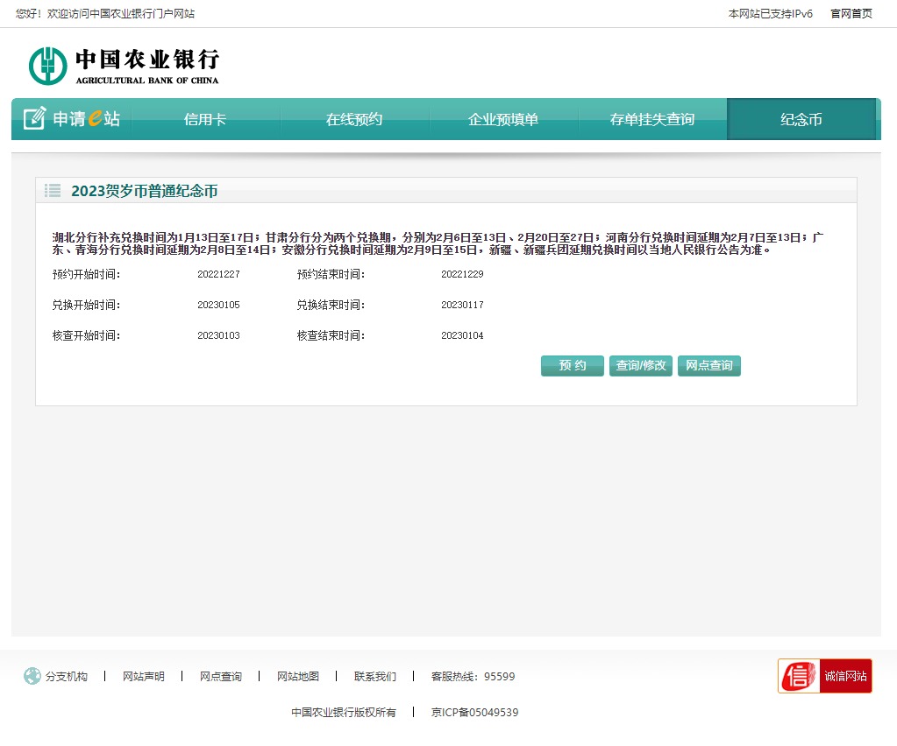
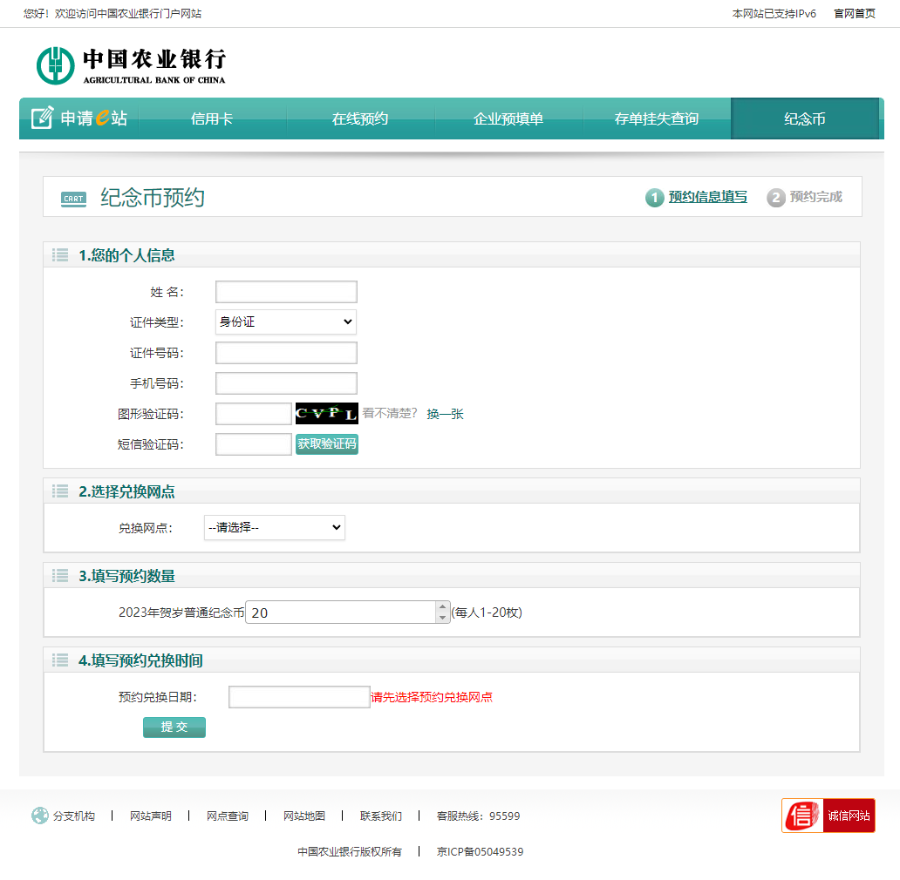
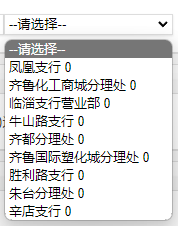
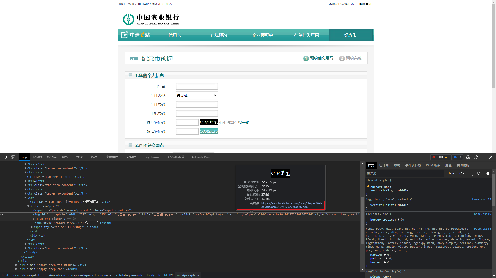
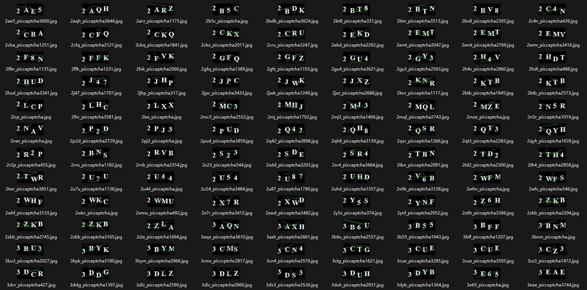
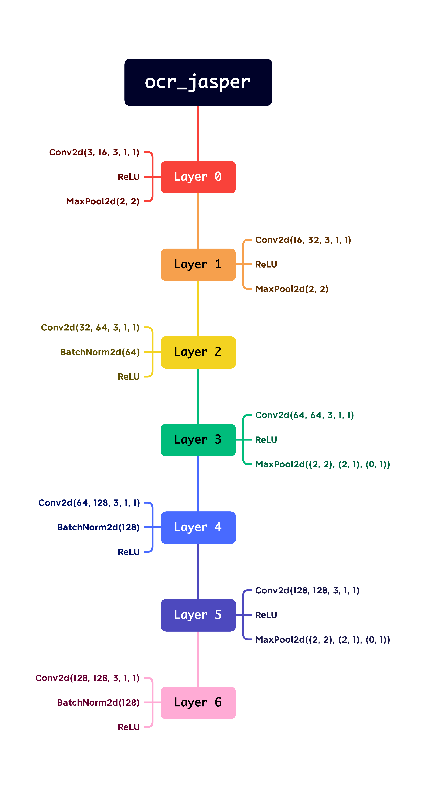

## 摘要

前段时间，2023 贺岁纪念币的预约火热地进行着，当晚我也凭借惊人的手速抢到了 3 *20 = 60 个，某天偶然打开农行预约纪念币网的站，发现预约端口还未关闭，便想着用 Selenium 自动化测试来实现全自动预约纪念币。

> [!NOTE] 技术栈
> 本文使用的技术包括但不仅限于：Python、Selenium-Python、OCR、CNN、Android ADB。

> [!WARNING] 声明
> 本文只用于技术分享，禁止使用本文代码参与各种不当获利行为。

## Part I：基本 Selenium 自动化

打开[农行纪念币预约网址](https://eapply.abchina.com/coin/coin/Index)，进入纪念币预约，可见布局如下：



接下来就是基本的 Selenium 自动化了，`F12`打开开发者工具，查看 “ 预约 ” 的 Xpath，但通过两次纪念币预约，我发现该元素的 Xpath 是随纪念币更改的，故每次要提前进入该网址获取本次预约的 Xpath。

> [!TIP] 配置建议
> 将所有配置项放在 `general_settings.py` 中，方便统一管理。

```python
# general_settings.py

# 驱动路径
path_chrome = Service_Chrome("../driver/chromedriver.exe")

# 预约链接
booking_url = "https://eapply.abchina.com/coin/Coin/CoinIssuesDistribution?typeid=202301"

# 预约界面 Xpath
welcome_page_xpath = '/html/body/div[5]/div[2]/table/tbody/tr[5]/td[4]/input[1]'
```

```python
# main.py

browser = webdriver.Chrome(service=general_settings.path_chrome)  # 使用 Chrome 驱动
browser.get(general_settings.booking_url)


def welcome_page():
    """
    欢迎页面
    :return: None
    """
    browser.find_element(By.XPATH, general_settings.welcome_page_xpath).click()
    browser.find_element(By.XPATH, '//*[@id="I128"]/button[1]').click()  # 同意并继续
```

接下来，进入今天我们的主战场，布局如下：



我将此页面分为如下五个部分：

1. 基本个人信息（姓名、证件号码、手机号码）
2. 图形验证码
3. 短信验证码
4. 兑换网点
5. 兑换时间

其中，1、4、5 在本 Part 展示，2、3 将在下文展示。

### 1. 基本个人信息

由于本次自动化是多线程同时进行，且为了个人信息安全和后期再有纪念币预约可以直接使用，故将个人信息放入 MySQL 数据库中，使用 Python 第三方库 pymysql 获取数据库信息并填写。

```python
# general_settings.py

# 数据库信息
host = ""  # 主机名（IP）
port = 3306  # 数据库端口，默认为 3306
user = ""  # 数据库用户名
password = ""  # 数据库密码
database = ""  # 信息所在 database（数据库）
table = ""  # 信息所在 table（表）
```

```python
# main.py

def info_get(host: str, port: int, user: str, password: str, database: str, table: str):
    """
    通过 MySQL 数据库获取信息
    :param host: 主机名（IP）
    :param port: 数据库端口
    :param user: 数据库用户名
    :param password: 数据库密码
    :param database: 信息所在 database
    :param table: 信息所在 table
    :return: 信息的元组
    """
    info_MySQL = Connection(
        host=host,
        port=port,
        user=user,
        password=password
    )  # 连接数据库
    cursor = info_MySQL.cursor()
    info_MySQL.select_db(database)
    cursor.execute(f'SELECT *  FROM {table};')
    result = cursor.fetchall()  # 获取所有信息
    info_mysql = result[thread_index]  # 获取对应进程的个人信息
    cursor.close()
    info_MySQL.close()
    return info_mysql
```

```python
# main.py

def fill_info(info: tuple):
    """
    填写信息函数
    :param info: 信息元组
    :return: None
    """
    browser.find_element(By.XPATH, '//*[@id="name"]').send_keys(info[1])  # 姓名
    browser.find_element(By.XPATH, '//*[@id="identNo"]').send_keys(info[2])  # 身份证号
    browser.find_element(By.XPATH, '//*[@id="mobile"]').send_keys(info[3])  # 电话号码
```

### 2. 兑换网点

兑换网点是一个下拉框对象，可以使用 Selenium 中 Select 函数对网点进行选择。省行、分行、支行都很顺利，但营业处选项遇到了一些问题，营业处的文本为 “营业处 + 当前剩余纪念币数”，若使用`select_by_index`会导致不知道默认选择的营业处是否还有纪念币。



故做以下修改：先选择默认营业处，若默认营业处剩余纪念币数 <= 20，则对营业处的列表进行遍历，选择剩余纪念币数 >= 20 的营业处，若都没有剩余，则输出 “ 该营业处没有剩余纪念币 ”。当然，你也可以再对支行、分行甚至省行（只要你能跑）的列表进行遍历，选择有剩余的营业处。

```python
# general_settings.py

# 预约地址
place_arr = ["", "", "", 4]  # 分别为 [省行, 分行, 支行, 默认营业厅序号（从 1 开始为第一个）]
```

```python
# main.py

def choose_place(province: str, city: str, country: str, default_bank_index: int):
    """
    选择兑换网点
    :param province: 省行名称
    :param city: 分行名称
    :param country: 支行名称
    :param default_bank_index: 默认营业处序号（从 1 开始为第一个营业处）
    :return: None
    """
    select_province = browser.find_element(By.XPATH, '//*[@id="orglevel1"]')  # 选择省行
    Select(select_province).select_by_visible_text(province)

	select_city = browser.find_element(By.XPATH, '//*[@id="orglevel2"]')  # 选择分行
    Select(select_city).select_by_visible_text(city)

    select_country = browser.find_element(By.XPATH, '//*[@id="orglevel3"]')  # 选择支行
    Select(select_country).select_by_visible_text(country)

    select_bank = browser.find_element(By.XPATH, '//*[@id="orglevel4"]')  # 选择营业处
    bank_text = select_bank.text
    bank_arr = bank_text.split("\n")
    default_coin_number = bank_arr[default_bank_index].split(" ")

    # 判断该营业处是否有剩余纪念币
    if int(default_coin_number[1]) >= 20:
        Select(select_bank).select_by_index(default_bank_index)
    else:
        for bank_index in range(1, len(bank_arr)):
            coin_number = bank_arr[bank_index].split(" ")
            if int(coin_number[1]) >= 20:
                Select(select_bank).select_by_index(bank_index)
                break
            else:
                print(f"进程{thread_index} 没有营业厅有纪念币了...")
                break
```

### 3. 兑换时间

选择时间可以通过两次定位来实现，但是速度较慢且 Xpath 路径不好写，且有时会涉及到 frame ，此时需要切换 frame，比较麻烦。所以本文使用 js 来处理时间控件，实现原理为删除 input 的 readonly 属性，直接输入日期。

```python
# general_settings.py

# 兑换时间
coindate = ""  # 按照'年-月-日'输入日期，例如：'2023-01-01'
```

```python
# main.py

def coin_date(coindate: str):
    """
    选择兑换时间
    :param coindate: 兑换时间
    :return: None
    """
    js_date = 'document.getElementById("coindate").removeAttribute("readonly");'  # 执行 js 代码去除 readonly 属性
    browser.execute_script(js_date)
    browser.find_element(By.ID, 'coindate').clear()  # 清除输入框
    browser.find_element(By.ID, 'coindate').send_keys(coindate)  # 输入日期
```

至此，基本的 Selenium 自动化已经完成。接下来，就是本文的核心：图像验证码与短信验证码。

## Part II：图形验证码

### 1. 图形验证码数据集获取

既然选择用深度学习识别验证码，首先就是获取验证码数据集。



在预约界面查找元素可知验证码的 src，刷新后会显示不同的图形验证码，这样图形验证码的数据源就搞定了。下面就是使用 requests 库爬取图形验证码，并以二进制方式写入到本地文件，这里一共爬取 3000 张验证码。

```python
# captcha_get.py

import time
import os
import requests


url = f'https://eapply.abchina.com/coin/Helper/ValidCode.ashx'

if not os.path.exists('./pic_captcha'):
    os.makedirs('./pic_captcha')

for index in range(3000):
    file = f'./pic_captcha/captcha_{index}.png'
    re = requests.get(url)
    with open(file, 'wb') as f:
        f.write(re.content)
    print(f'captcha_{index} finished...')
    time.sleep(0.1)
```

但由于这些验证码之后还需要进行标注，比较麻烦，特此将我用 2captcha 标注好的 3000 张验证码贴出来，格式为 " 验证码_piccaptcha+hash.png "。（别问我为什么不直接用 2captcha，因为一个验证码要 5 s，这速度还不如直接手动输入）



- [下载数据集 - Kaggle](https://www.kaggle.com/datasets/jasperxzy/pic-captcha-abc/download?datasetVersionNumber=1)
- [下载数据集 - AliCloud](https://image.jasperxzy.com/auto_commemorative_coin_booking_PIC_CAPTCHA.zip)

### 2. 训练模型

下面介绍本文采用的 CNN 模型 ocr_jasper，基于 mobildenetv2 修改而来，下图为网络结构。



训练代码在此就不详细说明了，详情可看仓库中 ” ocr_jasper_train “ 内的 `README.md` 。训练完成后，会得到 `model.onnx` 和 `charsets.json` 两个文件，分别为模型文件和字符集文件，这两个文件需配合 ocr_jasper 库使用。

### 3. 获取页面中图形验证码

上文爬取验证码时提到过，图形验证码的数据源是一条链接，所以无法直接通过链接直接下载图形验证码，故对图形验证码的元素进行截图并保存，方便 ocr_jasper 调用。

```python
# main.py

def pic_captcha_save():
    """
    定位验证码进行截图
    :return: None
    """
    captcha_img = browser.find_element(By.XPATH, '//*[@id="piccaptcha"]')  # 要截图的元素
    x, y = captcha_img.location.values()  # 坐标
    h, w = captcha_img.size.values()  # 宽高
    image_data = browser.get_screenshot_as_png()  # 把截图以二进制形式的数据返回
    screenshot = Image.open(BytesIO(image_data))  # 以新图片打开返回的数据
    result = screenshot.crop((x, y, x + w, y + h))  # 对截图进行裁剪
    result.save(f'./Captcha/pic_captcha_thread{thread_index}.png')
```

### 4. 使用 ocr_jasper 识别图形验证码

现在，就可以通过调用 ocr_jasper 来对图形验证码进行识别了，ocr_jasper 可以从本文的仓库中获取，在 CMD 或 Anaconda Prompt 中运行：

```bash
pip install {ocr_jasper} # 将 {ocr_jasper} 替换为 ocr_jasper 的相对或绝对路径
```

接下来就可以在代码中调用 ocr_jasper 了，将代码中`import_onnx_path`和`charsets_path`修改为训练好的模型和字符集文件的相对或绝对路径，默认放在项目根目录下的 Models 文件夹中。

```python
# main.py

def pic_captcha_recognition():
    """
    使用 ocr_jasper 识别图形验证码
    :return: None
    """
    ocr_pic = ocr_jasper.OCR(import_onnx_path='./Models/model.onnx',charsets_path="./Models/charsets.json")
    with open(f'./Captcha/pic_captcha_thread{thread_index}.png', 'rb') as f:
        image = f.read()
    captcha_recognized = ocr_pic.classification(image)
    browser.find_element(By.XPATH, '//*[@id="piccode"]').send_keys(captcha_recognized)  # 验证码输入框


def get_text_captcha():
    """
    获取短信验证码
    :return: None
    """
    browser.find_element(By.XPATH, '//*[@id="sendValidate"]').click()
```

### 5. 判断图形验证码是否识别正确

有时 ocr 会抽风，无法正确识别图形验证码，在此添加一个函数来判断是否识别正确。当识别错误时，id 为 `errorCaptchaNo`的元素会变成 ” 图形验证码错误 “；识别正确时，会变为 ” 短信验证码已发送成功 “，所以可以通过该元素文本长度来判断图形验证码是否识别正确。又因为`captcha_success`变量会跨函数多次调用，故将其定义为全局变量。

```python
# main.py

def captcha():
    """
    判断图形验证码是否正确
    :return: None
    """
    global captcha_success
    while True:
        pic_captcha_save()
        time.sleep(1)
        pic_captcha_recognition()
        get_text_captcha()
        time.sleep(0.5)
        is_captcha_error = browser.find_element(By.XPATH, '//*[@id="errorCaptchaNo"]').text
        if len(is_captcha_error) == 7:
            browser.find_element(By.XPATH, '//*[@id="piccaptcha"]').click()  # 重新获取验证码
            browser.find_element(By.XPATH, '//*[@id="piccode"]').clear()
        elif len(is_captcha_error) == 10:
            captcha_success = True
            break
```

## Part III：短信验证码

安卓系统获取手机短信验证码的方式有多种，可以通过短信数据库`mmssms.db`（需 root）或其他第三方平台进行获取，本文选择 adb 手机截屏 + ocr_jasper 识别的解决方案。（尊贵的 iOS 用户请自行解决本 Part）

### 1. 截图并裁剪短信验证码

在电脑上装好对应的手机驱动，手机打开开发者模式并开启 USB 调试，将手机通过 adb 连接到电脑后，可通过`adb devices`查看是否连接成功。

```python
# general_settings.py

# 短信验证码剪裁范围，坐标为 [y_0: y_1, x_0: x_1]
y_0 = 1550
y_1 = 1620
x_0 = 125
x_1 = 345
```

```python
# main.py

def text_captcha_save():
    """
    保存验证码的屏幕截图并裁剪验证码
    :return: None
    """
    text_captcha_path = f'./Captcha/text_captcha_tmp{thread_index}.png'
    os.system('adb shell screencap -p > ' + text_captcha_path)
    with open(text_captcha_path, 'rb') as f:
        data = f.read()
    text_captcha = data.replace(b'\r\n', b'\n')
    with open(f'./Captcha/text_captcha_tmp{thread_index}.png', 'wb') as f:
        f.write(text_captcha)
    raw_image = cv2.imread(f'./Captcha/text_captcha_tmp{thread_index}.png')
    cropped_image = raw_image[general_settings.y_0:general_settings.y_1, general_settings.x_0:general_settings.x_1]
    cv2.imwrite(f'./Captcha/text_captcha_{thread_index}.png', cropped_image)
```

### 2. 使用 ocr_jasper 识别短信验证码

和上文一样，调用 ocr_jasper 识别短信验证码，但本次不需要指定`import_onnx_path`和`charsets_path`，因为 ocr_jasper 内置了一个通用模型，对数字识别准确率接近 100%，而上文不使用内置模型的原因是此模型还包括 Unicode 编码中的所有汉字，会对图形验证码识别准确率有较大影响。

```python
# main.py

def text_captcha_recognition():
    """
    短信验证码识别
    :return: None
    """
    ocr_text = ocr_jasper.OCR(use_gpu=True)
    with open(f'./Captcha/text_captcha_{thread_index}.png', 'rb') as f:
        image = f.read()
    captcha_recognized = ocr_text.classification(image)
    browser.find_element(By.XPATH, '//*[@id="phoneCaptchaNo"]').send_keys(captcha_recognized)
```

### 3. 信息提交

```python
# main.py

def info_submit():
    """
    提交信息函数
    :return: None
    """
    browser.find_element(By.XPATH, '//*[@id="infosubmit"]').click()
```

## Part IV：主进程函数与多线程

由于全局变量跨文件使用比较麻烦，故将上述代码封装到主进程函数`main_func`函数中，结构如下：

```python
# main.py

def main_func(thread_index: int, place: list, date: str, input_enable: bool):
    """
    主进程
    :param thread_index: 进程序号
    :param place: 预约地址列表
    :param date: 预约时间
    :param input_enable: 是否为最后一个进程
    :return: None
    """
    global captcha_success
    browser = webdriver.Chrome(service=general_settings.path_chrome)
    browser.get(general_settings.booking_url)

    ---------functions mentioned above---------

    def welcome_page():
        ------------

    def info_get(host: str, port: int, user: str, password: str, database: str, table: str):
        ------------

    def fill_info(info: tuple):
        ------------

    def choose_place(province: str, city: str, country: str, default_bank_index: int):
        ------------

    def coin_date(coindate: str):
        ------------

    def pic_captcha_save():
        ------------

    def pic_captcha_recognition():
        ------------

    def get_text_captcha():
        ------------

    def captcha():
        ------------

    def text_captcha_save():
        ------------

    def text_captcha_recognition():
        ------------

    def info_submit():
        ------------

    try:
        welcome_page()
        info_tuple = info_get(host=general_settings.host,
                              port=general_settings.port,
                              user=general_settings.user,
                              password=general_settings.password,
                              database=general_settings.database,
                              table=general_settings.table)
        fill_info(info=info_tuple)
        choose_place(place[0], place[1], place[2], place[3])
        coin_date(coindate=date)
        captcha()
        time.sleep(3)
        text_captcha_save()
        text_captcha_recognition()
        info_submit()
    except Exception as e:
        print(e)
    if input_enable:
        input()
```

既然是 Selenium 自动化调试，就要充分发挥多线程的优势，但由于短信验证码只能挨个获取，所以在此项目中以短信验证码成功发送作为下一个进程开始的标志。

```python
# main.py

is_input_enable = False
for current_thread in range(general_settings.threads):
    if current_thread == general_settings.threads - 1:
        is_input_enable = True
    threading.Thread(target=main_func, args=(current_thread,
                                             general_settings.place_arr,
                                             general_settings.coindate,
                                             is_input_enable)).start()
    while True:
        if captcha_success:
            time.sleep(1)
            captcha_success = False
            break
        else:
            time.sleep(0.1)
```

## 结语

- 经过测试，预约 10 人的时间在 45 - 55 s 左右，速度还可以，但有些地方还可以再优化，如加载 csv 文件获取个人信息、使用多台手机同时接受短信验证码等，上述功能可能会在以后的更新中添加。

- 拖慢本程序的罪魁祸首是短信验证码发送的延迟，实测大约在 3.5 s 左右，像中行和工商银行等不需要短信验证的网站，速度将会直接起飞。
- 本文仓库：[Github](https://github.com/JasperXzy/auto_commemorative_coin_booking)
