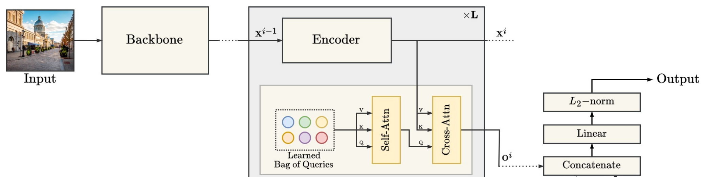
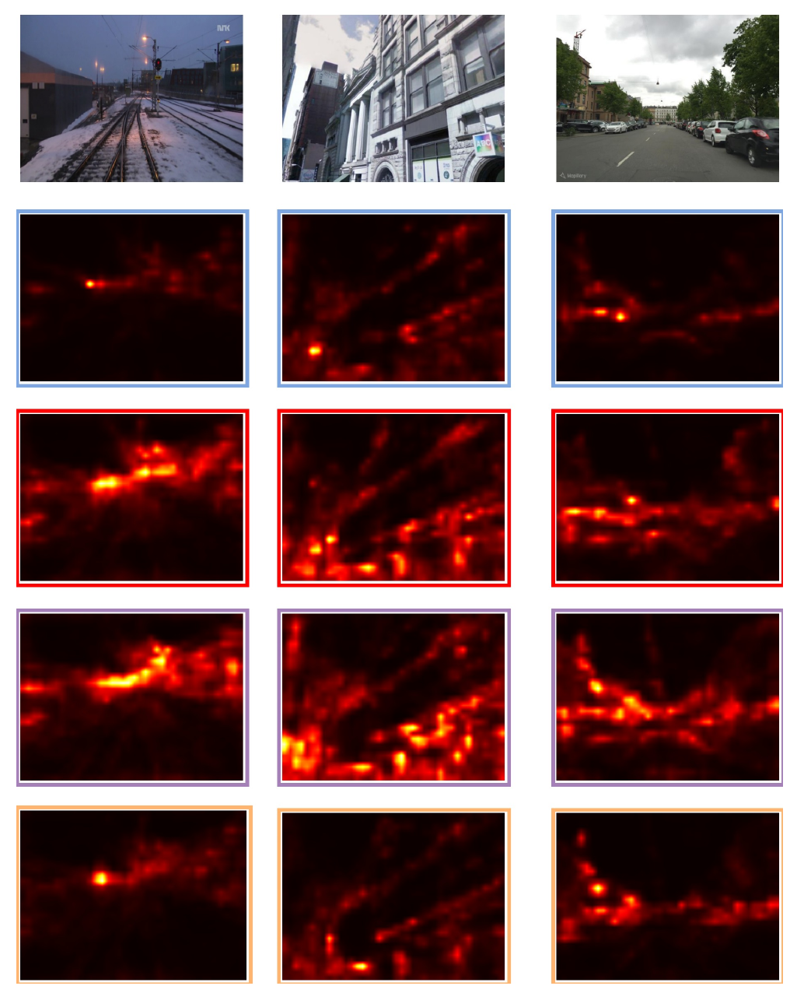

> [!NOTE] 论文信息
> **BoQ: A Place is Worth a Bag of Learnable Queries**，Amar Ali-bey、Brahim Chaib-draa、Philippe Giguère，CVPR 2024。原文：[arXiv](https://arxiv.org/abs/2405.07364) · [作者代码](https://github.com/amaralibey/Bag-of-Queries)

视觉地点识别的 backbone 会输出一组局部特征，检索系统通常将它们聚合为一个全局描述子。聚合时需要保留那些在视角、季节和光照变化后仍能代表地点的区域，并将其稳定地编码到同一个向量中。

NetVLAD 用聚类中心统计局部特征残差，GeM 用可学习广义均值进行全局池化，MixVPR 在空间和通道维度混合特征。BoQ 则训练一组与输入图像无关的全局 queries，通过 cross-attention 选择并汇总当前图像的局部特征。

这里的 query 不是待检索的查询图像，也不是某个具体地点的原型。它们是整个数据集共享的可学习探针，逐渐分工去关注建筑轮廓、植被、道路边缘、细粒度结构或更大范围的区域模式。

_图 1：每层 Encoder 后接一个 BoQ block，各层聚合结果最终拼接成全局描述子_

## Table of contents

## 1. 用共享 queries 聚合局部特征

设 backbone 输出 $N$ 个局部特征，每个特征维度为 $d$：

$$
\mathbf X^0
=
\left[
\mathbf x_1^0,\mathbf x_2^0,\ldots,\mathbf x_N^0
\right]
\in\mathbb R^{N\times d}.
$$

传统 pooling 对所有位置使用同一种固定规约；BoQ 则引入 $M$ 个模型参数：

$$
\mathbf Q^i
=
\left[
\mathbf q_1^i,\mathbf q_2^i,\ldots,\mathbf q_M^i
\right]
\in\mathbb R^{M\times d}.
$$

$\mathbf Q^i$ 不由输入图像生成。雪天铁路、夜间街道和历史建筑都使用同一组 queries 读取局部特征。随输入变化的是 attention 权重与聚合结果，聚合坐标系本身保持一致。

使用共享 queries 后，不同图像都由同一组探针编码。作者希望借此减少纯 self-attention 中聚合基准随输入变化所带来的不稳定性。

## 2. 一个 BoQ block 在做什么

多头注意力的基本形式可以简写为：

$$
\operatorname{MHA}(\mathbf q,\mathbf k,\mathbf v)
=
\operatorname{softmax}
\left(
\frac{\mathbf q\mathbf k^\top}{\sqrt d}
\right)
\mathbf v.
$$

BoQ 在第 $i$ 层先用 Transformer Encoder 更新图像特征：

$$
\mathbf X^i
=
\operatorname{Encoder}^i
\left(
\mathbf X^{i-1}
\right).
$$

接着有两个注意力步骤。

### 2.1 Queries 之间先交换信息

$$
\widetilde{\mathbf Q}^i
=
\operatorname{MHA}
\left(
\mathbf Q^i,\mathbf Q^i,\mathbf Q^i
\right)
+\mathbf Q^i.
$$

这是 query self-attention，用于建模 queries 之间的关系，减少重复关注并形成互补分工。由于 $\mathbf Q^i$ 与输入无关，这部分在推理时可以预先计算并缓存。

### 2.2 Queries 再从图像中读取信息

$$
\mathbf O^i
=
\operatorname{MHA}
\left(
\widetilde{\mathbf Q}^i,
\mathbf X^i,
\mathbf X^i
\right).
$$

其中：

- query：全局可学习探针 $\widetilde{\mathbf Q}^i$；
- key：当前层局部特征 $\mathbf X^i$；
- value：同一组局部特征 $\mathbf X^i$；
- 输出：每个 query 对整张图像加权汇总后得到的描述子。

如果有 $M$ 个 queries，输出 $\mathbf O^i$ 就包含 $M$ 个聚合结果。每个结果来自 query 权重对输入 value 的加权汇总，承载的是图像内容，需与 query 参数本身区分。

## 3. 为什么要聚合多个网络层

BoQ 将全部 $L$ 个 block 的输出拼接，保留最后一个 Encoder 之前各层的聚合结果：

$$
\mathbf O
=
\operatorname{Concat}
\left(
\mathbf O^1,\mathbf O^2,\ldots,\mathbf O^L
\right).
$$

随后通过一到两个线性层降维：

$$
\mathbf z
=
\mathbf W_2
\left(
\mathbf W_1\mathbf O
\right),
\qquad
\widehat{\mathbf z}
=
\frac{\mathbf z}{\|\mathbf z\|_2}.
$$

较早层保留更多局部纹理和空间细节，较晚层具有更强的全局上下文。拼接不同层的 query 输出，相当于同时保留多个语义尺度。

最后 Encoder 的图像 tokens 只作为 cross-attention 的 key/value 被 queries 读取，没有直接进入描述子。论文将进一步利用最后一层空间信息留作未来工作。

## 4. 与 DETR、NetVLAD 和 attention pooling 的区别

### 4.1 与 DETR 的区别

DETR 的 object queries 最终要输出对象类别和边界框，query 状态本身通过 decoder 不断更新，并直接参与预测。

BoQ 的 queries 只承担“读取器”角色。论文特意不在 query 与 cross-attention 输出之间加入残差连接，因此最终描述子来源于输入局部特征的加权聚合，而不是把一组固定 query 参数直接混入图像表示。

### 4.2 与 NetVLAD 的区别

NetVLAD 学习 cluster centers，并累计局部特征相对中心的残差；每个中心更像一个视觉词。

BoQ 不统计残差。它通过 query-key 相似度为当前图像动态生成空间权重，再对 value 加权求和。一个 query 可以在不同图像中关注位置完全不同、但功能相似的稳定结构。

### 4.3 与普通 attention pooling 的区别

如果 query 直接由输入产生，聚合标准会随图像改变。BoQ 使用全数据共享的参数 queries，希望为不同场景建立一致的探测基准，同时再通过 cross-attention 对每张图自适应读取。

## 5. 训练方式与注意力可解释性

BoQ 延续 GSV-Cities 的监督训练框架：

- 每个 batch 采样 120 至 200 个地点；
- 每个地点取 4 张图，总 batch size 为 480 至 800；
- 使用 Multi-Similarity Loss；
- ResNet 实验中把输入缩放到 $320\times320$；
- backbone 通常裁到倒数第二个 residual block，以保留更高分辨率局部特征；
- 用 $3\times3$ 卷积降低通道数，控制 attention 的计算和显存。

_图 2：三列是不同数据集的输入，四行热力图对应四个 learned queries_

可视化说明 queries 确实形成了不同关注模式：

- 有的 query 集中在少量细粒度高响应区域；
- 有的覆盖更大范围，编码场景整体结构；
- 补充材料显示，在天气、遮挡和视角变化下，部分 queries 持续关注建筑、树木和杆状物；
- 面对车辆等动态对象时，注意力更倾向道路背景与固定结构。

不过，attention heatmap 只能说明“模型从哪里读取”，不能单独证明该区域对最终相似度的因果贡献。要做更强解释，还需要遮挡、替换或 query ablation。

## 6. 实验与消融

### 6.1 与全局检索方法比较

下表使用 ResNet-50 backbone，列出论文 Table 2 的 R@1。先看城市检索基准：

| 方法        |  维度 | Pitts250k | MSLS-val |
| ----------- | ----: | --------: | -------: |
| Conv-AP     |  4096 |      92.4 |     83.4 |
| CosPlace    |  2048 |      92.3 |     87.4 |
| MixVPR      |  4096 |      94.2 |     88.0 |
| EigenPlaces |  2048 |      94.1 |     89.2 |
| **BoQ**     |  4096 |  **95.0** |     91.1 |
| **BoQ**     | 16384 |  **95.0** | **91.2** |

再看环境变化更强的基准：

| 方法        |     SPED | Nordland* |
| ----------- | -------: | --------: |
| Conv-AP     |     80.1 |      38.2 |
| CosPlace    |     75.3 |      54.4 |
| MixVPR      |     85.2 |      58.4 |
| EigenPlaces |     82.4 |      54.2 |
| **BoQ**     |     85.4 |      69.5 |
| **BoQ**     | **86.5** |  **70.7** |

BoQ 在普通城市数据上的增益不算巨大，但在 Nordland 的极端季节变化下优势明显。这与论文的动机一致：多个共享 queries 能从变化剧烈的图像中寻找不同类型的稳定证据。

### 6.2 单阶段检索的效率

论文的延迟对比中，BoQ 特征提取约为 7 ms，且不需要 re-ranking；R2Former 为 31 ms 特征提取加约 400 ms 重排。BoQ 在该表的 MSLS-val R@1 为 91.4，也高于 R2Former 的 89.7。

在论文使用的硬件、输入尺寸和候选数下，单阶段全局描述子减少了检索延迟。部署到其他平台时，需要重新测量这些耗时。

### 6.3 Query 数量

| Query 数 $M$ | MSLS-val R@1 | Pitts30k-val R@1 | AmsterTime R@1 |
| -----------: | -----------: | ---------------: | -------------: |
|            4 |         86.9 |             93.1 |           42.7 |
|            8 |         88.1 |             93.9 |           44.3 |
|           16 |         88.7 |             94.0 |           46.2 |
|           32 |         90.6 |             94.1 |           48.9 |
|           64 |         91.3 |             94.5 |           52.0 |

长期变化更强的 AmsterTime 从更多 queries 中获益最大。Pitts30k 已接近饱和，增加 queries 的收益较小。

正文与表格在这里有一处不一致：正文称 Pitts30k 从 8 到 64 queries 只提升 0.2 个百分点，但 Table 5 给出的是 93.9 到 94.5，即 0.6 个百分点。本文按表格数值引用。

### 6.4 Query self-attention 的作用

去掉 query self-attention 后，Nordland R@1 为 56.4；加入后达到 65.9。MSLS、Pitts30k 和 Pitts250k 也全部提升。这些结果支持保留 queries 之间的协同与去冗余步骤。

### 6.5 深度并非单调有效

使用 ResNet-18 时，BoQ blocks 从 1 增加到 4，多个数据集持续改善；增加到 8 后反而下降。ResNet-101 也没有超过 ResNet-50，论文认为原因之一是显存限制迫使训练使用更小 batch。

这提示结果同时受模型容量与 batch 内负样本丰富度影响，不能把“更深但更差”简单归因于 backbone 本身。

## 7. 方法边界与我的结论

### 7.1 训练资源仍然不轻

480 至 800 张图的大 batch 是高质量 online mining 的重要条件。BoQ 推理很快，但训练并不是低资源方案；减小 batch 后，难例分布和 Multi-Similarity 的效果都可能变化。

### 7.2 Attention 成本随局部 token 数增长

cross-attention 约随 $M N$ 增长，Encoder self-attention 约随 $N^2$ 增长。提高输入分辨率能提供更多细节，却会迅速增加计算。补充实验也显示，分辨率并非越高越好：某些数据集在 384 或 432 像素附近最佳，Nordland 在继续放大时反而下降。

### 7.3 描述子紧凑性需要主动选择

更多 queries、更多 blocks 会提升表征能力，也会增加拼接后的中间维度与参数。论文的 16384 维版本准确率最高，但在超大规模地图中会显著增加存储和相似度搜索成本；4096 维版本通常是更现实的折中。

### 7.4 全局描述子仍缺少显式几何验证

BoQ 学会了空间选择，却最终输出一个全局向量。对重复立面、相似道路或极端视角变化，它没有像局部匹配方法那样验证几何一致性。无重排是它的速度优势，也构成精细辨别能力的上限。

我更关注 BoQ 如何固定聚合基准：queries 在数据集内共享，读取图像时的权重则随输入变化。它们与可学习视觉词有相似之处，但比固定聚类中心更灵活，能在跨图像一致的聚合坐标系下动态选择局部特征。

对于需要单阶段、低延迟和环境鲁棒性的地点检索系统，可以借鉴这种聚合方式。实际采用时，还要结合大 batch 训练成本、描述子维度和几何验证需求作取舍。

## 参考资料

1. [论文原文：arXiv 2405.07364](https://arxiv.org/abs/2405.07364)
2. [BoQ 官方代码与模型](https://github.com/amaralibey/Bag-of-Queries)
3. [GSV-Cities 原文](https://arxiv.org/abs/2210.10239)
