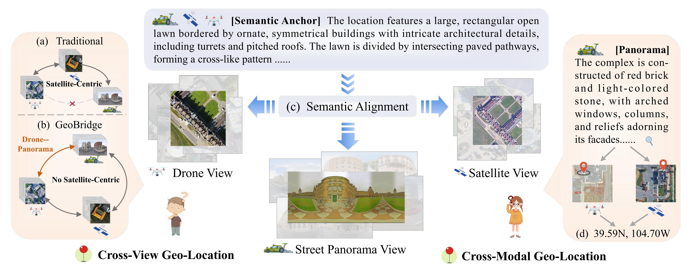
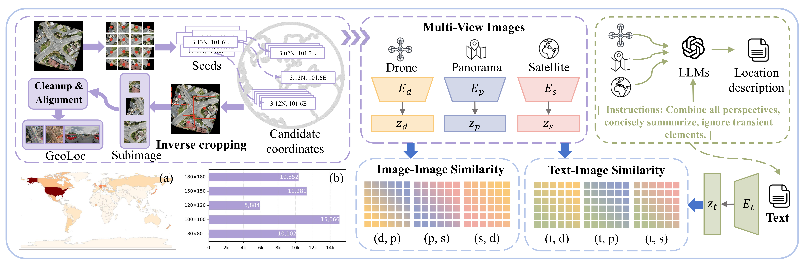

> [!NOTE] 论文信息
> **GeoBridge: A Semantic-Anchored Multi-View Foundation Model Bridging Images and Text for Geo-Localization**，Zixuan Song、Jing Zhang、Di Wang、Zidie Zhou、Wenbin Liu、Haonan Guo、En Wang、Bo Du，CVPR 2026。原文：[arXiv](https://arxiv.org/abs/2512.02697) · [作者代码](https://github.com/MiliLab/GeoBridge)。本文的方法与实验解读以 arXiv v3 为准。

GeoBridge 研究地面、无人机和卫星图像之间的地点检索，希望不同视角能够直接匹配，减少对卫星数据库的依赖。

传统任务通常是 ground-to-satellite 或 drone-to-satellite。卫星图提供统一的地理参考，但一旦卫星影像过旧、分辨率不足，或者当前可用数据库只有带坐标的无人机影像，这种任务划分就限制了系统的使用方式。

GeoBridge 将三个视觉视角放入同一个检索空间，用三视角共同生成的地点描述作为语义锚点。图像之间、文本与图像之间的对比学习共同约束这些表示，使不同视角能直接检索同一地点。方法的重点在于地点描述与监督关系的组织，跨视角匹配不依赖复杂的 attention 模块，图像检索时也不必输入文本。

_图 1：无人机、街景与卫星可以直接相互检索，文本提供共同的语义参照。_

## Table of contents

## 1. 问题设定：三视角共享检索空间

记三个图像视角为：

$$
\mathcal V=\{d,p,s\},
$$

其中 $d$ 表示 drone，$p$ 表示 street-view panorama，$s$ 表示 satellite。对任意不同的 $u,v\in\mathcal V$，模型希望完成：

$$
x^{(u)}\longrightarrow
\operatorname{Retrieve}\bigl(\mathcal D^{(v)}\bigr).
$$

因此，三种视角对应六个有方向的检索任务：

| 查询视角   | 可检索的其他视角     |
| ---------- | -------------------- |
| 无人机 $d$ | 卫星 $s$、街景 $p$   |
| 街景 $p$   | 卫星 $s$、无人机 $d$ |
| 卫星 $s$   | 无人机 $d$、街景 $p$ |

如果数据库图像带有坐标，取回匹配条目就能估计查询地点的位置。这属于基于检索的定位，模型不直接回归经纬度，也不输出完整的六自由度相机位姿。

论文中的 closed-loop multi-view 指不同视角之间都有可用的检索路径。这里没有额外设计 cycle-consistency loss，也不涉及 SLAM 中的闭环检测与后端优化。

### 1.1 最困难的边是无人机与街景

无人机和卫星至少都能看到屋顶、路网与地面布局；街景看到的却是建筑立面、路旁设施与遮挡后的局部环境。三幅图来自同一坐标，并不意味着存在足够多的直接视觉对应。

语义锚点尝试利用这些观测中共同的结构关系。同一栋建筑在不同视角下形状差异很大，但“建筑旁有弯曲道路，道路另一侧是开阔绿地”这样的描述，可能同时适用于不同视角。

## 2. GeoLoc：先把地点、覆盖范围与语义对齐

GeoBridge 与 GeoLoc 数据集需要一起理解。没有地点级配准的三视角样本，模型就无法获得一致的跨视角正样本关系；没有共同描述，文本又容易退化成各视角独立的 caption。

### 2.1 一个样本包含什么

训练实例可以写为：

$$
\mathcal X_i=
\left(x_i^{(d)},x_i^{(p)},x_i^{(s)},t_i\right).
$$

前三项来自同一地点，$t_i$ 是综合这些视角生成的一段描述。根据论文第 4 节，GeoLoc 包含 52,679 组三视角图像，覆盖 36 个国家；其中 5,351 组来自与训练部分不重叠的城市，用作留出评测集。

这里的 52,679 指地点级图像组，不是三个视角合计只有这么多张图片。城市不重叠的划分也比简单随机拆分相邻街景更有意义，因为它降低了利用近邻地理背景获得虚高结果的风险。

### 2.2 反向裁剪为什么重要

无人机影像来自 OpenAerialMap，街景和卫星影像来自 Google 相关服务。作者先从带地理参考的大幅无人机影像生成种子坐标，再查询实际存在的街景位置，并用返回的街景坐标重新裁剪无人机影像。

这样处理是因为请求的坐标可能与街景实际拍摄坐标不同。

如果直接用请求坐标裁剪航拍图，再把附近街景当成严格配对，监督误差就会在模型训练前被引入。反向裁剪让街景观察点尽量位于对应无人机子图的中心，再匹配相应卫星覆盖区域。

数据还包含约 $80\times80$、$100\times100$、$120\times120$、$150\times150$ 和 $180\times180$ 平方米的地面覆盖尺度。这些面积描述覆盖范围，不能用来直接推断无人机飞行高度。

### 2.3 数据清洗也是方法成立的条件

论文对重复覆盖、无效像素、模糊、低对比度和缺少有效结构的图像进行了筛选，包括 BH-Gate、C-Gate 与 UN-Gate 三类质量过滤。

从训练角度看，清洗减少了两类噪声：

- 两个高度重叠的地点被当成 negatives，形成假负样本；
- 一张图只有大面积水面或无纹理区域，却要求它与丰富街景建立精确对应。

但筛选也带来分布偏好：模型更常看到结构清晰、具有可辨别地物的场景。因此，GeoLoc 上有效不意味着在荒漠、开阔水域和低纹理自然环境中同样可靠。

## 3. 语义锚点：用共同描述约束不同视觉分支

_图 2：GeoLoc 提供对齐数据，GeoBridge 通过图像与文本的联合对比学习统一多视角表示。_

### 3.1 综合三视角生成共同描述

语义锚点综合同一地点的三幅图，强调建筑、道路、桥梁、河流、绿地等相对稳定的地物，以及它们之间的空间关系，尽量忽略行人、车辆等瞬时元素和强视角依赖措辞。

例如，下面是为了说明机制而构造的描述，并非论文原句：

> 一栋长方形建筑沿道路布置，建筑北侧是一片开阔绿地，弯曲道路连接附近的交叉口。

这类描述压缩了观测信息，保留在视角变化后仍可能成立的关系，并不意味着文本比图像更准确。如果只写“街边有两辆汽车”，就很难为卫星图提供可靠监督。

论文使用 GPT-4o 离线生成描述，在线定位时不调用它。补充材料还比较了其他描述生成模型；这一环节需要的是有效的多视角语义监督，可以尝试不同的生成模型。

### 3.2 三个视觉编码器与一个共享文本编码器

模型包含三个视角专属视觉编码器 $E_d,E_p,E_s$，以及一个文本编码器 $E_t$。各分支以 CLIP 初始化，主要实验使用 CLIP-L/14。

对任意图像视角 $v$，归一化 embedding 为：

$$
\mathbf z_i^{(v)}=
\frac{E_v(x_i^{(v)})}{\|E_v(x_i^{(v)})\|_2},
\qquad
\mathbf z_i^{(t)}=
\frac{E_t(t_i)}{\|E_t(t_i)\|_2}.
$$

所有输出位于相同维度的检索空间，视觉分支的参数则相互独立。官方模型定义分别实例化了 drone、satellite 和 street encoder。

这与多传感器早期融合不同：模型没有先把三幅图合并，再产生一个只适用于完整输入的地点描述子。每个分支仍然独立输出 embedding，因此推理时可以只调用实际需要的视角分支。

### 3.3 文本为什么可能帮助图像之间的匹配

可以把一个训练地点看成四个节点：三个视觉节点和一个文本节点。图像之间的监督要求它们保持地点一致，文本节点则为三种视觉观测提供共同的语义参照。

我的理解是，这相当于为困难的跨视角匹配增加了一条监督路径：

$$
\text{街景外观}
\longleftrightarrow
\text{地点语义}
\longleftrightarrow
\text{俯视结构}.
$$

这条语义监督路径无法保证几何对齐。相邻街区可能拥有几乎相同的文字描述，生成文本也可能遗漏区分地点所需的细节，因此仍需保留图像之间的直接约束。

## 4. 联合对比学习：两组简单损失如何分工

### 4.1 相似度矩阵与单方向 InfoNCE

设一个 batch 有 $B$ 个地点，将视角 $u$ 和 $v$ 的归一化 embedding 分别堆叠为 $\mathbf Z_u,\mathbf Z_v$，得到：

$$
\mathbf S_{u,v}
=\frac{\mathbf Z_u\mathbf Z_v^\top}{\tau}
\in\mathbb R^{B\times B},
$$

其中 $\tau$ 是可学习温度。若 batch 中各分支按地点对齐，则对角线是正样本，其他列是候选负样本。

论文式 (3) 的单方向损失为：

$$
\mathcal L(\mathbf S)
=-\frac1B\sum_{i=1}^{B}
\log\frac{\exp S_{i,y_i}}
{\sum_{j=1}^{B}\exp S_{i,j}}.
$$

$y_i$ 是第 $i$ 个查询的正确匹配列；按相同顺序组织 batch 时，$y_i=i$。

### 4.2 图像之间保留直接的地点约束

按论文式 (4)，图像对齐项为：

$$
\begin{aligned}
\mathcal L_{\text{img}}
=\frac13\bigl[&\mathcal L(\mathbf S_{d,s})
+\mathcal L(\mathbf S_{s,p})\\
&+\mathcal L(\mathbf S_{p,d})\bigr].
\end{aligned}
$$

这组约束要求各视觉分支区分具体地点，而不只是预测宽泛的场景语义。即使两个地点都有“道路旁的矩形建筑”，直接图像监督仍有机会保留建筑布局、相对尺度等差异。

### 4.3 文本把三个分支拉向共同语义

文本与各视觉分支之间的损失为：

$$
\mathcal L_{\text{text}}
=\frac13\sum_{v\in\{d,p,s\}}
\mathcal L(\mathbf S_{t,v}).
$$

最终目标直接相加：

$$
\mathcal L_{\text{total}}
=\mathcal L_{\text{img}}
+\mathcal L_{\text{text}}.
$$

两类损失等权相加。

上面按正文公式保留了损失方向。常见的 CLIP 式对称交叉熵还会加入转置矩阵的损失，是否采用这种实现需要单独核对；支持双向检索本身不要求损失采用双向平均。

### 4.4 从梯度看，它依然在进行负样本加权

下面是对上述损失的直接推导。令：

$$
p_{ij}=\frac{\exp S_{ij}}{\sum_k\exp S_{ik}},
$$

则：

$$
\frac{\partial\mathcal L}{\partial S_{ij}}
=\frac1B\left(p_{ij}-\mathbb 1[j=y_i]\right).
$$

对负样本，模型认为它越像正确地点，$p_{ij}$ 越大，对应的排斥梯度也越大。这与之前 [Multi-Similarity Loss 精读](/posts/multi_similarity_loss_paper_reading/) 中的 pair weighting 视角相通。

GeoBridge 更侧重正样本关系的构建，以及约束这些关系的共享语义监督，对 mining 或 weighting 公式本身改动较少。地点配对错误或文本质量低的问题，仍需从数据端处理。

## 5. 推理：按查询与数据库视角调用分支

以街景检索无人机数据库为例，先离线计算数据库 embedding：

$$
\mathcal D_d=
\{(\mathbf z_j^{(d)},\mathbf g_j)\}_{j=1}^{N},
$$

其中 $\mathbf g_j$ 是数据库条目的地理坐标。在线输入街景，计算：

$$
j^*=\arg\max_j
\left(\mathbf z_q^{(p)}\right)^\top\mathbf z_j^{(d)},
\qquad
\widehat{\mathbf g}_q=\mathbf g_{j^*}.
$$

这个过程只需查询街景与预先编码的无人机数据库，无需生成 caption，也不要求查询地点额外提供卫星图和无人机图。完整配对数据用于训练阶段的监督。

若输入改成文本，则用 $E_t$ 编码，再检索其他视角的图像库。论文跨模态评测使用单视角描述作为查询，与综合三视角生成的训练锚点不同，后者通常不能直接作为用户可获得的输入。

端侧实时性能还需要测量。即使没有在线文本处理，视觉 backbone、数据库规模和近邻索引仍会影响延迟，无法据此推导具体 FPS。

## 6. 实验与消融

以下数值均为论文报告的百分比，表格注明对应来源；不同任务的 gallery、训练数据和评测协议不同，不宜只按数值大小横向比较。

### 6.1 GeoLoc：新增的无人机-街景路径确实可用

从论文 Table 5 抽取 Sample4Geo 与 GeoBridge 的 R@1：

| 检索方向      | Sample4Geo | GeoBridge |
| ------------- | ---------: | --------: |
| 无人机 → 卫星 |      27.27 | **45.05** |
| 卫星 → 无人机 |      28.70 | **44.81** |
| 街景 → 卫星   |      16.82 | **38.87** |
| 卫星 → 街景   |      18.87 | **39.20** |
| 无人机 → 街景 |      29.51 | **41.22** |
| 街景 → 无人机 |      15.56 | **41.15** |

最后两行评估了过去较少研究的无人机与街景直接检索。街景到无人机相比该基线提升了 25.59 个百分点，不过 R@1 仍只有 41.15%，不少查询的首位结果错误。这条路径有所改善，距离可靠定位仍有差距。

### 6.2 消融说明：文本对包含街景的匹配尤其重要

论文 Table 8 报告：

| 检索方向      | Image-only | Text-only |  联合训练 |
| ------------- | ---------: | --------: | --------: |
| 无人机 → 卫星 |      38.20 |     42.83 | **45.06** |
| 卫星 → 无人机 |      34.63 |     42.83 | **44.81** |
| 街景 → 卫星   |       6.43 |     35.40 | **38.87** |
| 卫星 → 街景   |       6.95 |     36.40 | **39.21** |
| 无人机 → 街景 |       7.16 |     39.00 | **41.23** |
| 街景 → 无人机 |       4.90 |     38.63 | **41.15** |

这里的 Text-only 指训练时只保留文本-图像损失，测试仍然评估图像之间的检索，没有改成文本输入。

纯图像训练在 drone-satellite 上还能工作，但涉及街景时下降明显；文本监督大幅改善了这些困难方向，联合图像监督后又进一步提高。这支持“语义桥接对大视角差异更关键”的解释。

Table 8 与 Table 5 的少数完整模型数值相差 0.01，以上保留各表原值，没有把它们混成同一组记录。Image-only 消融也不是上一表中的 Sample4Geo，两者不能互换使用。

### 6.3 公共基准：迁移表现强，但不是纯零样本

论文先在 GeoLoc 上预训练，再在公共基准上微调最后三层。以 Table 2 的 University-1652 为例：

| 方法       | 无人机 → 卫星 R@1 | 卫星 → 无人机 R@1 |
| ---------- | ----------------: | ----------------: |
| Sample4Geo |             92.65 |             95.14 |
| DAC        |             94.67 |             96.43 |
| GeoBridge  |         **95.82** |         **97.14** |

Table 4 中，GeoBridge 的 CVUSA R@1 为 99.14，VIGOR-Cross R@1 为 73.87。它们说明 GeoLoc 预训练后的表征具有迁移价值，但不能写成“完全不看目标数据就达到这些结果”。

同样，“整体表现强”不等于每项指标都第一。例如 VIGOR-Same 的 Hit，GeoBridge 为 92.24，低于 AuxGeo 的 93.78；SUES-200 的个别高度下，drone-to-satellite R@1 也不是最优。

### 6.4 文本检索的绝对表现仍是明显短板

从论文 Table 7 选择几组 GeoLoc 文本查询任务：

| 查询 → 数据库       | CLIP-L/14 R@1 | GeoBridge R@1 |
| ------------------- | ------------: | ------------: |
| 街景描述 → 卫星图   |          2.71 |      **5.68** |
| 街景描述 → 无人机图 |          2.02 |      **6.10** |
| 卫星描述 → 街景图   |         12.20 |     **21.58** |
| 无人机描述 → 卫星图 |          2.88 |      **2.93** |

不同文本查询方向的表现差异很大，有的提升明显，有的几乎不变。模型保留了跨模态检索能力，但这些结果不足以支持任意自然语言描述下的精确地点检索。

论文还在仅含 100 对图文的 RSIEval 上报告 29.00 / 71.00 / 88.00 的 R@1/5/10。它可以作为补充证据，却不能替代大规模地理检索评测。

## 7. 局限与复现时需要注意的地方

### 7.1 共同语义不等于精确几何

全局描述子适合快速召回，但“同样有十字路口和矩形建筑”的地点可能很多。对重复建筑、相邻街区和需要米级定位的任务，我更倾向于把 GeoBridge 作为候选检索阶段，再接局部几何验证，而不是直接把 top-1 当成最终可靠定位。

### 7.2 文本是有噪声的监督，不是地理真值

多视角描述能减少单视角遗漏，却不能消除生成幻觉，也可能把某个视角看不到的结构强加给该分支。更细致的后续实验可以分别检查地物名称、空间关系和跨视角可见性，判断究竟是哪一类文字信息在起作用。

### 7.3 数据规模、初始化与监督方式共同影响结果

主实验使用 CLIP-L/14，输入为 $224\times224$，在八张 A800 上以 batch size 32、200 epochs 进行训练。迁移结果因此同时包含大模型初始化、GeoLoc 数据和语义监督的作用。

消融支持语义锚点有效，单位计算量下的收益则需要控制 backbone、数据量和训练预算后再比较。论文对“foundation model”的支持来自上述迁移实验，尚未验证任意环境下直接部署的效果。

### 7.4 公开数据不等于完整三视角数据可直接下载

官方仓库明确区分了无人机子集与 Google 来源影像：公开提供处理后的无人机数据，不直接再分发街景和卫星图；完整三视角数据需要按作者说明重建。

这是复现时的实际门槛。即使模型结构和损失并不复杂，重新获取影像的成本、覆盖情况和时间变化，也可能使重建数据与论文使用的数据不同。不能仅凭“代码和数据已公开”就断言完整实验可以一键复现。

## 8. 与之前精读的联系，以及我的结论

[AGPlace](/posts/agplace_neural_odes_paper_reading/) 与 GeoBridge 都在处理航拍和地面之间的差异，但它们解决的层次不同：

| 工作      | 主要问题                                   | 核心手段                                     |
| --------- | ------------------------------------------ | -------------------------------------------- |
| AGPlace   | 地面图像与点云怎样融合，再与航拍表示匹配   | 代理融合流形、Neural ODE、模态回注           |
| GeoBridge | 三种视觉视角怎样独立编码，却能直接相互检索 | 地点级三视角配对、文本语义锚点、联合对比学习 |

因此，两篇论文不应按某个 Recall 数字直接判断高下。AGPlace 更关注多传感器输入下的融合机制；GeoBridge 更关注训练监督与检索任务的组织方式。

GeoBridge 让我更关注监督信号包含什么。地点标签告诉模型哪些图像对应同一地点，共同描述进一步指出哪些信息可能跨视角保留。面对街景与俯视图之间较大的外观差异，这类监督值得尝试。

共同描述在训练时提炼稳定的地点信息，图像之间的直接监督则保留地点判别性。它不能替代视觉或保证几何一致性，但图像检索时不需要在线生成文本，也能使用训练得到的跨视角表示。

## 参考资料

1. [GeoBridge 论文原文，arXiv:2512.02697v3](https://arxiv.org/abs/2512.02697v3)
2. [GeoBridge 官方仓库与数据发布说明](https://github.com/MiliLab/GeoBridge)
3. [GeoBridge 官方模型定义](https://github.com/MiliLab/GeoBridge/blob/main/code/GeoBridge.py)
4. [GeoLoc 公开无人机数据子集](https://huggingface.co/datasets/Son12s/GeoLoc)
