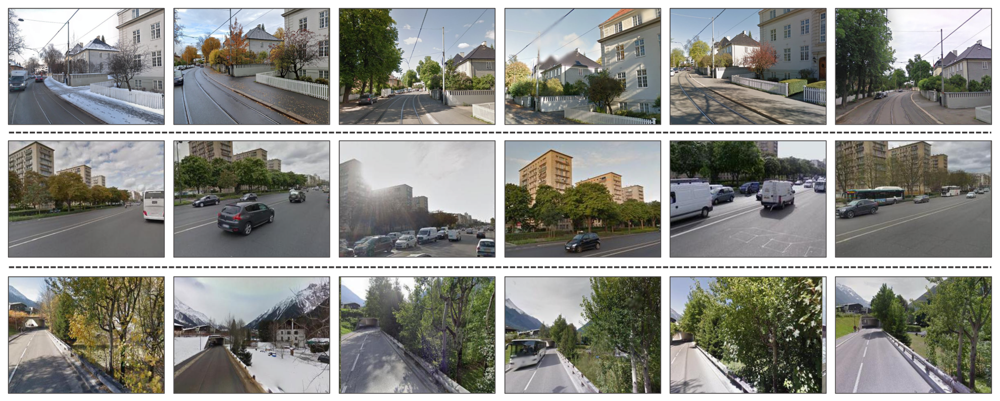
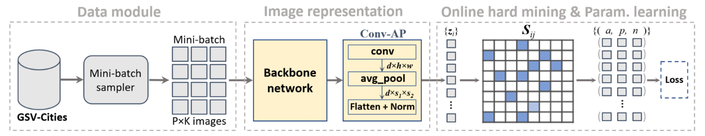

> [!NOTE] 论文信息
> **GSV-Cities: Toward Appropriate Supervised Visual Place Recognition**，Amar Ali-bey、Brahim Chaib-draa、Philippe Giguère，2022。原文：[arXiv](https://arxiv.org/abs/2210.10239) · [作者代码与数据说明](https://github.com/amaralibey/gsv-cities)

GSV-Cities 表面上是一篇“数据集论文”，但它真正改变的是视觉地点识别（Visual Place Recognition，VPR）的训练范式。以往的大规模 VPR 数据通常只有 GPS 弱标签。两张图距离很近，不代表相机朝向相同，也不保证它们真的看到了同一处场景。模型因此只能从一组 potential positives 中选择最像查询图的那一张作为正样本。这样虽然避免了错配，却会让训练长期依赖 **easiest positive**，恰好绕开了季节、天气、视角和建筑变化这些最值得学习的困难正样本。

GSV-Cities 的核心做法是：利用 Google Street View Time Machine 中同一位置、同一朝向、不同时间的历史影像，为每个地点建立可靠的 place ID。标签一旦足够准确，VPR 就能直接使用成熟的深度度量学习方法：

> **按地点采样 mini-batch，在 batch 内构造所有正负样本关系，再在线挖掘真正有信息量的 pair 或 triplet。**

_图 1：每一行对应一个 place ID，不同列是同一物理位置在不同时间的观测_

## Table of contents

## 1. 弱监督的根本问题不是标签少，而是正样本不确定

设查询图为 $q$，根据 GPS 距离得到 potential positive 集合 $\mathcal P_q$，再从远处图像中得到 negative 集合 $\mathcal N_q$。经典弱监督 VPR 通常使用：

$$
S_q^+
=
\max_{p_i\in\mathcal P_q}
S(q,p_i),
$$

$$
\mathcal L_{\text{weak}}
=
\sum_{n_j\in\mathcal N_q}
\left[
S(q,n_j)-S_q^++m
\right]_+,
$$

其中 $S(\cdot,\cdot)$ 是相似度，$S_q^+$ 是当前最容易匹配的 positive，$m$ 是 margin。

式子中的

$$
\max_{p_i\in\mathcal P_q}S(q,p_i)
$$

就是查询图当前最容易匹配的 positive。这样设计是无奈之举：$\mathcal P_q$ 中的图像虽然与查询位置接近，却可能朝向完全不同；选最相似的一张，至少更可能是正确匹配。

问题在于，模型只需不断拉近“本来就最像”的图像：

- 同一地点在夏季与冬季的巨大外观变化可能一直没有进入监督；
- 正面与侧面视角之间的困难匹配会被忽略；
- offline hard negative mining 仍需周期性编码大量数据库图像，训练成本很高；
- 损失函数无法安全使用所有正样本，也就难以发挥 Multi-Similarity 等方法的 pair weighting 能力。

因此，论文判断 VPR 的瓶颈并不只是网络结构，而是 **大规模训练数据缺少可以直接用于监督度量学习的精确 place label**。

## 2. GSV-Cities 如何构造可靠的 place ID

论文使用 Google Street View Time Machine 收集 2007 至 2021 年间的历史全景图。数据构建包含四个关键约束。

### 2.1 地理覆盖

作者从各大洲选择 40 个城市，并以经纬度约 $0.001^\circ$ 的间隔查询位置，对应约 100 至 130 米。较大的间隔用于避免两个 place ID 覆盖明显重叠的场景。

### 2.2 时间重复观测

只保留至少被 Street View 采集过 4 次的位置。每个最终地点包含 4 至 20 张跨时间图像，因此一个 ID 内天然包含天气、季节、光照、车辆和局部结构变化。

### 2.3 位置与朝向同时对齐

仅有 GPS 还不够。作者同时读取历史全景图的 bearing，并据此生成朝向一致的透视图。于是，同一 ID 的图像不仅来自同一坐标，也尽量观察同一场景方向。

### 2.4 数据规模

| 属性           |                  GSV-Cities |
| -------------- | --------------------------: |
| 图像数量       |                    约 56 万 |
| 地点数量       |                   约 6.7 万 |
| 城市数量       |                          40 |
| 时间跨度       |                  2007--2021 |
| 每个地点图像数 |                       4--20 |
| 覆盖面积       | 超过 $2{,}000\ \text{km}^2$ |

这里的“精确标签”仍应准确理解：它来自高质量定位、相同位置与 bearing 的程序化约束，而不是对 56 万张图逐一人工配对。论文报告进行了定性检查且未发现失败，但这并不等价于严格测得零标签噪声。

## 3. 从 place ID 到 $P\times K$ 监督采样

把第 $i$ 个地点写成：

$$
\mathcal P_i
=
\left(
\left\{I_1^i,I_2^i,\ldots,I_{K_i}^i\right\},
y_i
\right),
$$

其中 $y_i$ 是唯一 place ID。训练时先采样 $P$ 个不同地点，再从每个地点随机选 $K$ 张图，得到大小为

$$
B=P\times K
$$

的 mini-batch。

论文默认使用 $P=100$、$K=4$，即一个 batch 有 400 张图。经过 backbone 与聚合层后，图像被映射为 $L_2$ 归一化描述子：

$$
\mathbf z_i
=
\frac{f_\theta(I_i)}
{\left\|f_\theta(I_i)\right\|_2},
\qquad
S_{ij}=\mathbf z_i^\top\mathbf z_j.
$$

这样，一个 batch 中的监督关系完全确定：

- $y_i=y_j$：positive pair；
- $y_i\ne y_j$：negative pair；
- 每张图都可以同时充当 anchor、positive 和 negative；
- 相似度矩阵 $\mathbf S$ 可以直接用于 online hard mining。

_图 2：从按地点采样、图像表征，到 batch 内相似度矩阵、在线难例挖掘和度量损失_

这一步是论文最关键的贡献。它把 VPR 从“先全库检索难例，再猜哪个 potential positive 是真的”转换为标准的监督度量学习问题，offline mining 的昂贵缓存过程也随之消失。

## 4. Conv-AP：保留粗粒度空间布局的紧凑聚合

除了数据集，论文还提出了一个很简单的全卷积聚合层 Conv-AP。

设 backbone 输出：

$$
\mathbf F\in\mathbb R^{h\times w\times c}.
$$

第一步用 $1\times1$ 卷积把通道数从 $c$ 投影到 $d$：

$$
\mathbf F'
=
\operatorname{Conv}_{1\times1}(\mathbf F),
\qquad
\mathbf F'\in\mathbb R^{h\times w\times d}.
$$

第二步使用 adaptive average pooling，把空间分辨率压缩到固定的 $s_1\times s_2$：

$$
\mathbf z
=
\operatorname{AAP}_{s_1\times s_2}
\left(
\operatorname{Conv}_{1\times1}(\mathbf F)
\right).
$$

最后 flatten 并进行 $L_2$ 归一化，描述子维度为：

$$
D=d\,s_1s_2.
$$

Conv-AP 的价值不在复杂度，而在它没有直接把空间维度压成 $1\times1$。当 $s_1=s_2=2$ 时，描述子仍保留“左上、右上、左下、右下”四个粗区域的顺序。论文实验显示，完全使用 global average pooling 会损失这种空间结构。

例如：

- $d=2048,\ s=1$：输出 2048 维，但空间顺序完全消失；
- $d=512,\ s=2$：同样输出 2048 维，却在 Pitts250k 和 MSLS 上都更好；
- $d=512,\ s=2$ 的 2048 维 Conv-AP 还能超过 32768 维 NetVLAD，描述子缩小 16 倍。

## 5. 为什么 Multi-Similarity 在这里效果最好

作者在 GSV-Cities 的 2 万个地点子集上比较了五类度量损失。所有方法使用相同训练框架，区别主要在 pair/triplet 的选择和加权。

| 损失函数                        | Pitts30k R@1 | MSLS-val R@1 |
| ------------------------------- | -----------: | -----------: |
| Contrastive                     |         86.7 |         67.8 |
| Contrastive + MS miner          |         87.8 |         71.8 |
| Triplet + online hardest mining |         85.2 |         60.4 |
| FastAP                          |         87.0 |         67.7 |
| Circle                          |         86.9 |         72.2 |
| **Multi-Similarity**            |     **89.2** |     **76.9** |

这个结果说明了两件事。

第一，**准确标签只是打开了上限，mining 与 weighting 决定能否利用它**。同一个 Contrastive Loss 加上 MS miner 后，MSLS-val R@1 从 67.8 提升到 71.8。

第二，VPR 需要同时处理大量跨时间 positives 与大量外观相近 negatives。Multi-Similarity 不只选一个最难 triplet，而是在边界附近保留多个 informative pairs，再按相对难度平滑加权，因此更适合这种 batch 结构。

## 6. 实验应该怎样读

### 6.1 数据的价值大于更换聚合器

把同一个 NetVLAD 从 Pitts30k 或 MSLS 训练切换到 GSV-Cities，结果发生明显变化：

| 训练数据       | Pitts250k R@1 | MSLS-val R@1 | Nordland R@1 |
| -------------- | ------------: | -----------: | -----------: |
| Pitts30k       |          86.0 |         59.5 |          4.1 |
| MSLS           |          48.7 |         48.6 |          2.4 |
| **GSV-Cities** |      **90.5** |     **82.6** |     **32.6** |

论文还报告，NetVLAD 在 MSLS 训练流程中约需 55 天，而在 GSV-Cities 上约需 8 小时，主要差异来自 offline mining 与 online mining。这个“165 倍”数字很醒目，但并非严格控制硬件、实现和训练预算后的纯数据集对照，更适合作为训练流程开销的量级说明。

### 6.2 Conv-AP 的收益来自空间与紧凑性的平衡

在统一使用 GSV-Cities 训练时，城市检索基准结果为：

| 方法                   |  维度 | Pitts R@1 | MSLS R@1 |
| ---------------------- | ----: | --------: | -------: |
| NetVLAD                | 32768 |      90.5 |     82.6 |
| CosPlace               |  2048 |      91.5 |     83.0 |
| **Conv-AP $2\times2$** |  8192 |  **92.4** | **83.4** |
| Conv-AP $4\times4$     | 32768 |      92.2 |     80.1 |

环境变化基准结果为：

| 方法                   | SPED R@1 | Nordland R@1 |
| ---------------------- | -------: | -----------: |
| NetVLAD                |     78.7 |         32.6 |
| CosPlace               |     75.3 |         34.4 |
| **Conv-AP $2\times2$** |     80.1 |     **38.2** |
| Conv-AP $4\times4$     | **81.2** |         34.3 |

不能简单得出“空间网格越大越好”。$2\times2$ 的整体表现最好，而 $4\times4$ 只在 SPED 上取得更高结果。更细空间划分会增加描述子维度，也可能对视角变化更敏感。

## 7. 局限、影响与我的结论

### 7.1 它解决了监督问题，但没有消除数据偏差

数据来自 Street View，主要覆盖道路可达的城市与郊区场景。模型能否迁移到室内、越野、校园小路或非 Street View 摄像机域，仍取决于后续数据和评测。

### 7.2 place ID 的间隔让训练更干净，也让任务更容易分离

约 100 至 130 米的采样间隔减少了地点重叠和假 negatives，却不完全等价于真实机器人在连续街区中进行米级定位。密集位置、相邻路口和重复建筑仍可能需要更细的空间监督。

### 7.3 大 batch 是性能条件的一部分

$100\times4=400$ 的 batch 为 online mining 提供了丰富 negatives，但也带来显存门槛。缩小 batch 时，损失函数比较和难例质量都可能发生变化。

### 7.4 Conv-AP 是强基线，不是对几何匹配的替代

它生成单个全局描述子，检索速度快，但没有显式验证局部几何。极端视角变化或外观高度重复时，二阶段局部匹配仍可能提供额外价值。

这篇论文最值得记住的不是“56 万张图”或某个 Recall 数字，而是一个训练系统观点：

> **当监督标签能明确表达“同一地点的困难变化”时，成熟的度量学习、在线难例挖掘和简单聚合器就能释放出远高于弱监督流程的能力。**

后续的 Conv-AP、MixVPR、BoQ 等工作大量沿用 GSV-Cities 与 Multi-Similarity 训练框架。它因此不仅提供了一个数据集，也重新定义了近几年 VPR 方法应该如何被公平训练和比较。

## 参考资料

1. [论文原文：arXiv 2210.10239](https://arxiv.org/abs/2210.10239)
2. [GSV-Cities 官方代码与数据说明](https://github.com/amaralibey/gsv-cities)
3. [Multi-Similarity Loss 原文](https://arxiv.org/abs/1904.06627)
