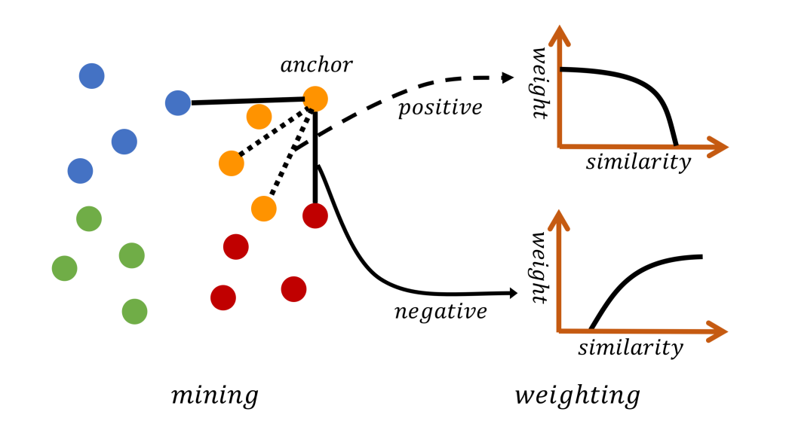
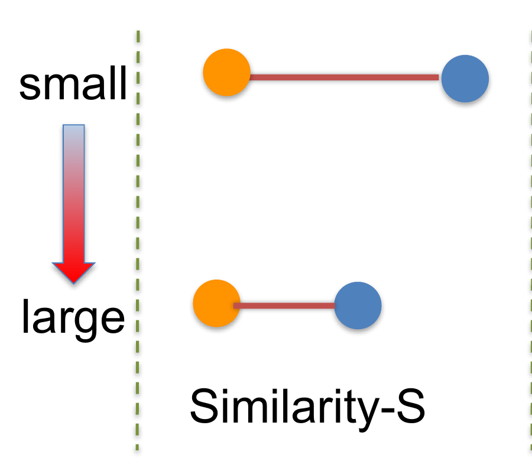
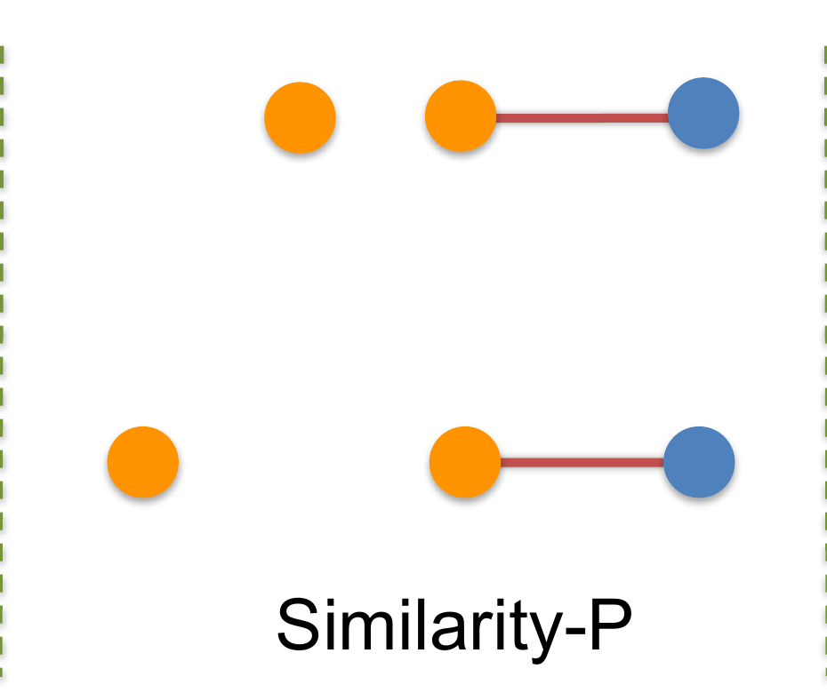
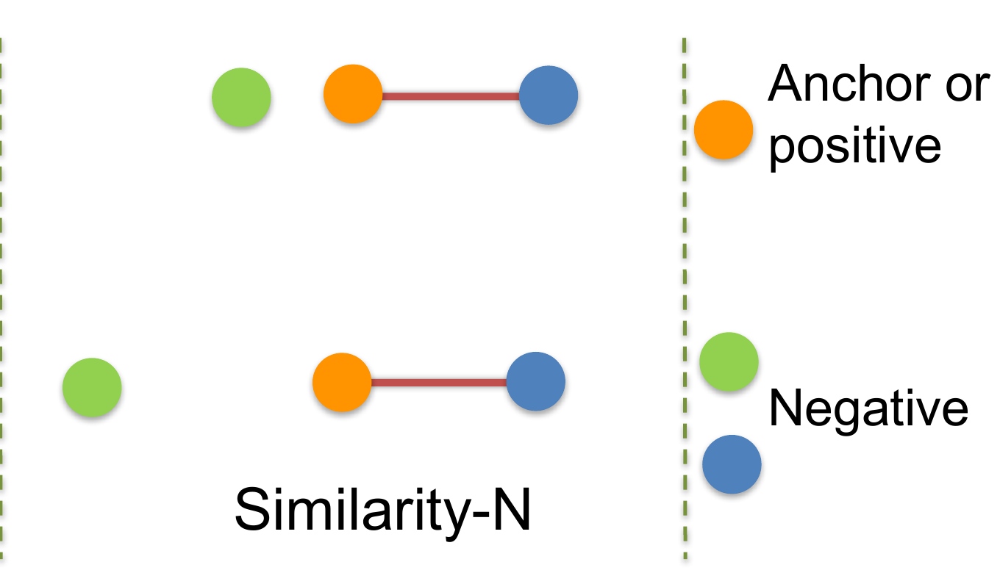

> [!NOTE] 论文信息
> **Multi-Similarity Loss with General Pair Weighting for Deep Metric Learning**，Xun Wang、Xintong Han、Weilin Huang、Dengke Dong、Matthew R. Scott，CVPR 2019。原文：[arXiv](https://arxiv.org/abs/1904.06627) · [CVF Open Access](https://openaccess.thecvf.com/content_CVPR_2019/html/Wang_Multi-Similarity_Loss_With_General_Pair_Weighting_for_Deep_Metric_Learning_CVPR_2019_paper.html) · [作者代码](https://github.com/MalongTech/research-ms-loss)

Multi-Similarity Loss，简称 **MS Loss**，解决的是深度度量学习中一个看似简单、实际很棘手的问题：一个 mini-batch 能产生大量正负样本对，但它们的训练价值并不相同。容易样本往往已经满足约束，真正决定决策边界的是少量难样本；如果只做随机采样，梯度会被冗余 pair 淹没；如果只取最难样本，又容易受异常值和标签噪声支配。

这篇论文最重要的贡献不只是提出一个新损失，而是先建立 **General Pair Weighting（GPW）**：把 Contrastive、Triplet、Lifted Structure、Binomial Deviance 等 pair-based loss 都解释为“给相似度分配梯度权重”。在这个统一视角下，hard mining 不再是损失函数外部的技巧，而是把无效 pair 的权重直接设为 0。

一句话概括 MS Loss：

> **先用正负 pair 的相对次序筛出决策边界附近的样本，再用平滑的 log-sum-exp 同时衡量 pair 自身有多难、它相对同类 pair 有多难。**

_图 1：MS Loss 的两阶段结构，左侧在 batch 内挖掘 informative pairs，右侧对保留的正负 pair 进行软加权。_

## Table of contents

## 1. 问题设定：度量学习到底在优化什么

设一个 mini-batch 中有 $m$ 个样本，网络输出经过 $L_2$ 归一化后的 embedding：

$$
\mathbf z_i=\frac{f(\mathbf x_i;\theta)}{\|f(\mathbf x_i;\theta)\|_2}.
$$

论文使用余弦相似度：

$$
S_{ij}=\mathbf z_i^\top \mathbf z_j,\qquad S_{ij}\in[-1,1].
$$

同类样本组成 positive pair，希望 $S_{ij}$ 变大；异类样本组成 negative pair，希望 $S_{ij}$ 变小。一个 batch 可以得到 $m\times m$ 的相似度矩阵，但其中绝大多数 pair 已经很好地区分开，对更新参数几乎没有价值。

因此，pair-based metric learning 总是在回答两个问题：

1. **Mining：哪些 pair 值得进入本次优化？**
2. **Weighting：进入优化后，每个 pair 应该贡献多大的梯度？**

以往方法通常分别设计采样器和损失函数。MS Loss 的出发点是：这两件事其实可以放进同一个“梯度权重”框架中理解。

## 2. GPW：用梯度统一 pair-based loss

任意以相似度矩阵为输入的 pair-based loss 都可以写成：

$$
\mathcal L=\mathcal L(\mathbf S,\mathbf y).
$$

根据链式法则：

$$
\frac{\partial \mathcal L}{\partial\theta}
=\sum_{i=1}^{m}\sum_{j=1}^{m}
\frac{\partial\mathcal L}{\partial S_{ij}}
\frac{\partial S_{ij}}{\partial\theta}.
$$

在第 $t$ 次迭代，把当前的 $\partial\mathcal L/\partial S_{ij}$ 暂时视为常数，可以构造一个局部线性函数：

$$
\mathcal F(\mathbf S,\mathbf y)
=\sum_{i=1}^{m}\sum_{j=1}^{m}
\left.\frac{\partial\mathcal L}{\partial S_{ij}}\right|_t S_{ij}.
$$

$\mathcal F$ 与原损失 $\mathcal L$ 在当前迭代具有相同的参数梯度。通常，negative pair 的导数非负，positive pair 的导数非正。定义

$$
w_{ij}=\left|\frac{\partial\mathcal L}{\partial S_{ij}}\right|,
$$

便得到 GPW 的核心形式：

$$
\mathcal F
=\sum_i\left(
\sum_{y_j\neq y_i}w_{ij}S_{ij}
-\sum_{y_j=y_i}w_{ij}S_{ij}
\right).
$$

这个式子把各种 pair-based loss 的差异压缩成一个问题：**它们如何计算 $w_{ij}$？**

- $w_{ij}=0$：该 pair 被 mining 丢弃；
- 所有被选 pair 的 $w_{ij}$ 相等：hard selection，但没有精细 weighting；
- $w_{ij}$ 随难度连续变化：soft weighting；
- $w_{ij}$ 依赖其他 pair：当前 pair 会在 batch 的局部分布中参与竞争。

### 2.1 经典损失在 GPW 下的区别

| 方法              | 选择或加权规则                            | GPW 视角下的局限                                 |
| ----------------- | ----------------------------------------- | ------------------------------------------------ |
| Contrastive Loss  | 负 pair 超过固定阈值才参与                | 被选 pair 基本等权，只看自身相似度               |
| Triplet Loss      | $S_{an}+\lambda>S_{ap}$ 的 triplet 参与   | 只判断正负相对次序，有效 triplet 内仍等权        |
| Binomial Deviance | 对相似度使用 softplus                     | 能连续衡量自身难度，但不比较相邻 pair            |
| Lifted Structure  | 在同一 anchor 的 pair 间做 softmax 式竞争 | 关注相对难度，但固定平移全部相似度时权重可能不变 |

论文由此提出：判断一个 pair 是否重要，至少需要同时观察多个相似性关系，而不是只看一个 $S_{ij}$。

## 3. 三类相似度：S、P、N

论文从一个 negative pair 出发，将“难度”拆成三个互补视角。positive pair 可以作对称分析。

以下三张图由论文 Figure 2 拆分。每张图从上到下难度提高，理论上应获得更大权重；橙色表示 anchor 或 positive，绿色和蓝色表示 negatives。

### 3.1 Similarity-S：pair 自身相似度

对于 negative pair，$S_{ij}$ 越大，两个不同类别的样本越接近，越容易混淆；对于 positive pair，$S_{ij}$ 越小，同类样本越分散。

这就是最直观的“hardness”。Contrastive Loss 和 Binomial Deviance 主要依赖这个信息。

### 3.2 Similarity-P：相对 positive pair 的难度

一个 negative pair 的绝对相似度并不足以判断其价值。假设它的 $S_{ij}=0.6$：

- 如果同一 anchor 的 positive similarity 是 $0.9$，正负排序仍然清楚；
- 如果 positive similarity 只有 $0.55$，negative 已经排在 positive 前面，检索排序发生错误。

因此 Similarity-P 衡量的是正负 pair 之间的相对次序。Triplet Loss 与 Histogram Loss 主要利用这一关系。MS Loss 把它放在 **mining 阶段**，用于定位分类边界附近的 pair。

### 3.3 Similarity-N：相对其他 negative pair 的难度

即使两个 negative pair 的绝对相似度相同，它们在各自 anchor 的局部分布中也可能承担不同角色。一个明显高于其他 negatives 的 pair 更可能是当前 anchor 的主要混淆对象，应该获得更大权重。

Lifted Structure、N-pairs 和 NCA 主要使用这种 batch 内的相对竞争关系。

| 方法                       |   S   |   P   |   N   |
| -------------------------- | :---: | :---: | :---: |
| Contrastive / Binomial     |   ✓   |       |       |
| Triplet / Histogram        |       |   ✓   |       |
| N-pairs / Lifted Structure |       |       |   ✓   |
| NCA                        |       |   ✓   |   ✓   |
| BinLifted                  |   ✓   |       |   ✓   |
| **MS Loss**                | **✓** | **✓** | **✓** |

这里的关键不在于简单相加三种规则，而在于为它们安排不同职责：**P 负责筛选，S 与 N 负责连续加权。**

## 4. 第一步：在边界附近挖掘 informative pairs

对 anchor $i$，先定义 positive 与 negative 的索引集合：

$$
\mathcal P_i=\{k\mid y_k=y_i,\ k\ne i\},\qquad
\mathcal N_i=\{k\mid y_k\ne y_i\}.
$$

相应的 positive similarities 与 negative similarities 分别由 $k\in\mathcal P_i$ 和 $k\in\mathcal N_i$ 给出。

### 4.1 挖掘 negative pair

negative pair $(i,j)$ 被保留，当且仅当：

$$
S_{ij}>\min\bigl\{S_{ik}\mid k\in\mathcal P_i\bigr\}-\epsilon.
$$

右侧是该 anchor 的 **hardest positive**，即相似度最低的 positive。只要一个 negative 没有比 hardest positive 明显更远，它就仍可能干扰检索排序。

### 4.2 挖掘 positive pair

positive pair $(i,j)$ 被保留，当且仅当：

$$
S_{ij}<\max\bigl\{S_{ik}\mid k\in\mathcal N_i\bigr\}+\epsilon.
$$

右侧是 **hardest negative**，即相似度最高的 negative。已经远高于所有 negatives 的容易 positive 不再参与本轮优化。

$\epsilon$ 控制边界带宽：

- $\epsilon$ 越小，越接近严格 hard mining；
- $\epsilon$ 越大，保留的 pair 越多，训练更平滑但计算与冗余增加；
- 论文与官方实现均使用 $\epsilon=0.1$。

这一步比“只取最难的一个样本”更稳健。它保留一组靠近边界的 pair，后续再用连续权重区分它们，而不是让单个极端样本垄断梯度。

## 5. 第二步：用 log-sum-exp 进行软加权

记挖掘后的 positive 和 negative 索引集合为 $\mathcal P_i$、$\mathcal N_i$。每个 anchor 的损失由两部分组成：

$$
\mathcal L_i^{+}
=\frac{1}{\alpha}\log\left[
1+\sum_{k\in\mathcal P_i}e^{-\alpha(S_{ik}-\lambda)}
\right],
$$

$$
\mathcal L_i^{-}
=\frac{1}{\beta}\log\left[
1+\sum_{k\in\mathcal N_i}e^{\beta(S_{ik}-\lambda)}
\right].
$$

完整的 MS Loss 为：

$$
\boxed{
\mathcal L_{MS}
=\frac{1}{m}\sum_{i=1}^{m}
\left(\mathcal L_i^{+}+\mathcal L_i^{-}\right)
}
$$

对相似度求导，可以直接看到 GPW 中的 pair 权重：

$$
w_{ij}^{+}
=\frac{e^{-\alpha(S_{ij}-\lambda)}}
{1+\sum_{k\in\mathcal P_i}e^{-\alpha(S_{ik}-\lambda)}},
$$

$$
w_{ij}^{-}
=\frac{e^{\beta(S_{ij}-\lambda)}}
{1+\sum_{k\in\mathcal N_i}e^{\beta(S_{ik}-\lambda)}}.
$$

这两个权重同时包含两层信息：

1. **分子衡量自身难度（Similarity-S）**：低相似度 positive、高相似度 negative 的指数项更大；
2. **分母引入组内竞争（Similarity-N 及其正样本对称形式）**：pair 的权重还取决于同一 anchor 下其他已选 pair。

式子中的常数 $1$ 可以看成一个相似度位于 $\lambda$ 的参考项。$\alpha$ 和 $\beta$ 决定 softmax 的尖锐程度：论文使用 $\alpha=2$、$\beta=50$，说明 positive 端较平滑，negative 端非常接近“集中关注最难 negatives”。

### 5.1 一个数值例子

假设某个 anchor 的 positive similarities 为 $[0.82,0.65]$，negative similarities 为 $[0.62,0.30]$，并取 $\epsilon=0.1$：

- hardest positive 为 $0.65$，negative 的筛选线是 $0.55$，因此只保留 $0.62$；
- hardest negative 为 $0.62$，positive 的筛选线是 $0.72$，因此只保留 $0.65$。

使用官方代码中的 $\lambda=0.5$、$\alpha=2$、$\beta=40$ 时，这两个 pair 的单项梯度权重约为：

$$
w^+\approx0.426,\qquad w^-\approx0.992.
$$

它表达了一个直观判断：相似度为 $0.62$ 的异类样本已经越过参考阈值，应该被强力推开；相似度为 $0.65$ 的同类样本仍需拉近，但梯度不必像 hard negative 那样尖锐。

## 6. 为什么不是把两个已有损失直接相加

一个自然想法是把 Binomial Deviance 的自身难度权重与 Lifted Structure 的相对权重求平均。论文称这一基线为 **BinLifted**。

问题在于，直接相加容易被两个分量中较大的一个支配：

- pair 的绝对相似度很容易时，相对项仍可能给出较大权重；
- pair 的绝对相似度很难时，自身项又可能忽略局部 negatives 已经整体移动后的相对变化。

MS Loss 不是把两个权重相加，而是把自身项和组内竞争放进同一个归一化分式，再先用 Similarity-P 做边界筛选。补充材料用两个反例说明，BinLifted 会给难度明显不同的 pair 分配近似权重，而 MS weighting 会随二者共同变化。

## 7. 消融实验

论文在 Cars-196、64 维 embedding 上分别启用 S、P、N，Recall@1 如下：

| 方法                         | 使用的信息    | Recall@1 |
| ---------------------------- | ------------- | -------: |
| Binomial                     | S             |     71.9 |
| LiftedStruct$^*$             | N             |     69.7 |
| MS mining                    | P             |     67.0 |
| BinLifted                    | S + N         |     70.4 |
| MS weighting                 | S + N         |     73.2 |
| Binomial + MS mining         | S + P         |     74.6 |
| LiftedStruct$^*$ + MS mining | N + P         |     72.2 |
| **MS Loss**                  | **S + P + N** | **77.3** |

可以得到四个结论：

1. **S 是最重要的单一信息**：只看自身相似度的 Binomial 达到 71.9；
2. **N 能细化权重**：MS weighting 相比 Binomial 提升到 73.2；
3. **P 适合用于 mining**：给 Binomial 加边界挖掘后，从 71.9 提升到 74.6；
4. **组合方式比信息数量更重要**：简单的 BinLifted 只有 70.4，甚至低于单独的 Binomial。

### 7.1 检索结果

下表只列论文中的 Recall@1：

| 数据集                    | MS-64 | MS-128 | MS-512 |
| ------------------------- | ----: | -----: | -----: |
| CUB-200-2011              |  57.4 |      - |   65.7 |
| Cars-196                  |  77.3 |      - |   84.1 |
| Stanford Online Products  |  74.1 |   76.6 |   78.2 |
| In-Shop Clothes Retrieval |     - |   88.0 |   89.7 |

论文的主要经验结论是：MS Loss 在细粒度数据集与大类别检索数据集上都有效；embedding 从 64 增至 512 通常继续受益，但 Cars-196 上增至 1024 已没有必要。

比较这些数字时仍需谨慎：不同基线使用的 embedding 维度、集成模块和模型容量并不完全一致。论文特别指出 ABE/ABIER 属于 ensemble 方法，而 MS Loss 本身不是靠集成获得提升。

## 8. 方法的局限

### 8.1 强依赖 batch 组成

MS Loss 只能比较同一个 batch 内的 pair。batch 太小、类别太多但每类实例太少，都会导致 hardest positive/negative 不稳定，甚至找不到 informative pair。

补充材料指出，在类别变化更大的 SOP 上，batch size 为 20 时，超过 20% 的迭代无法挖掘到足够有效的 hard negatives；扩大 batch 后 Recall@1 持续改善。相比之下，CUB200 对 batch size 没那么敏感。

### 8.2 时间与显存复杂度是 $O(m^2)$

完整相似度矩阵以及 pair mask 都随 batch size 平方增长。MS Loss 希望更大的 batch 获得更好的局部分布，但这又直接增加显存和计算成本。

### 8.3 hard pair 可能就是噪声

错误标签、离群点和极端增广样本往往会被判断为最难 pair。较大的 $\beta$ 会进一步放大这些 negatives 的影响。噪声较多时，应考虑减小 $\beta$、限制 mining 范围、使用鲁棒采样，或先清理标签。

### 8.4 超参数与相似度尺度耦合

$\lambda$、$\epsilon$、$\alpha$、$\beta$ 都建立在归一化余弦相似度上。若 embedding 没有归一化，特征范数就能任意改变 logits，原参数几乎失去含义。

### 8.5 GPW 有隐含符号假设

论文默认 positive pair 的梯度推动相似度上升，negative pair 的梯度推动相似度下降。对常见度量损失成立，但 GPW 的正负权重解释并非对任意包含复杂耦合项的目标都自动成立。

## 9. 总结

Multi-Similarity Loss 的价值可以分成两层。

第一层是 **GPW 的分析视角**：pair-based loss 的核心不是公式长什么样，而是相似度获得了多大梯度。sampling 是 0/1 权重，soft loss 是连续权重，许多经典方法因此可以放在同一坐标系中比较。

第二层是 **MS Loss 的职责分工**：

1. 用 Similarity-P 找到正负排序边界附近的 informative pairs；
2. 用 Similarity-S 衡量 pair 自身有多难；
3. 用 Similarity-N 和组内归一化衡量它相对邻居有多难；
4. 用 log-sum-exp 平滑聚合，避免只依赖单个 hardest pair。

真正值得迁移到其他任务的，不一定是原样照搬公式，而是这条设计原则：**先定义“信息量”来自哪些相对关系，再决定哪些关系用于筛选，哪些关系用于连续加权。**

## 参考资料

1. Wang et al. [Multi-Similarity Loss with General Pair Weighting for Deep Metric Learning](https://arxiv.org/abs/1904.06627), CVPR 2019.
2. 作者公开实现：[MalongTech/research-ms-loss](https://github.com/MalongTech/research-ms-loss).
3. Song et al. [Deep Metric Learning via Lifted Structured Feature Embedding](https://openaccess.thecvf.com/content_cvpr_2016/html/Song_Deep_Metric_Learning_CVPR_2016_paper.html), CVPR 2016.
4. Sohn. [Improved Deep Metric Learning with Multi-class N-pair Loss Objective](https://proceedings.neurips.cc/paper/2016/hash/6b180037abbebea991d8b1232f8a8ca9-Abstract.html), NeurIPS 2016.
