YOLOv8 是最新的最先进的 YOLO 模型，可用于对象检测、图像分类和实例分割任务。YOLOv8 由 Ultralytics 开发，他们还创建了十分流行的 YOLOv5 模型。 YOLOv8 在 YOLOv5 的基础上包含了许多架构和开发人员体验的变化和改进。下面将分析 YOLOv8 的改进以及如何在 MSCOCO2017 数据集上训练 YOLOv8。

## YOLOv8 性能预览

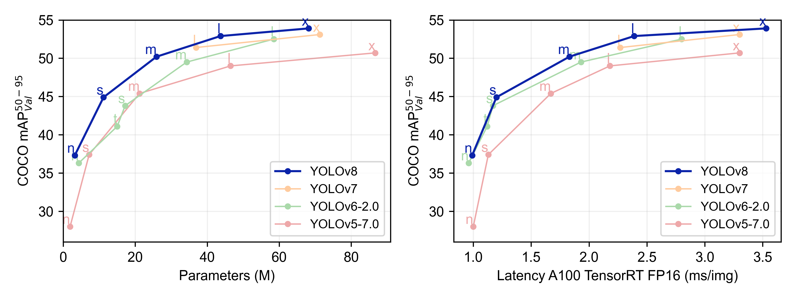

不难看出，YOLOv8 的性能比 YOLO 的其他模型在参数数量相似的情况下都具有更好的精度。

## YOLOv8 的改进与创新

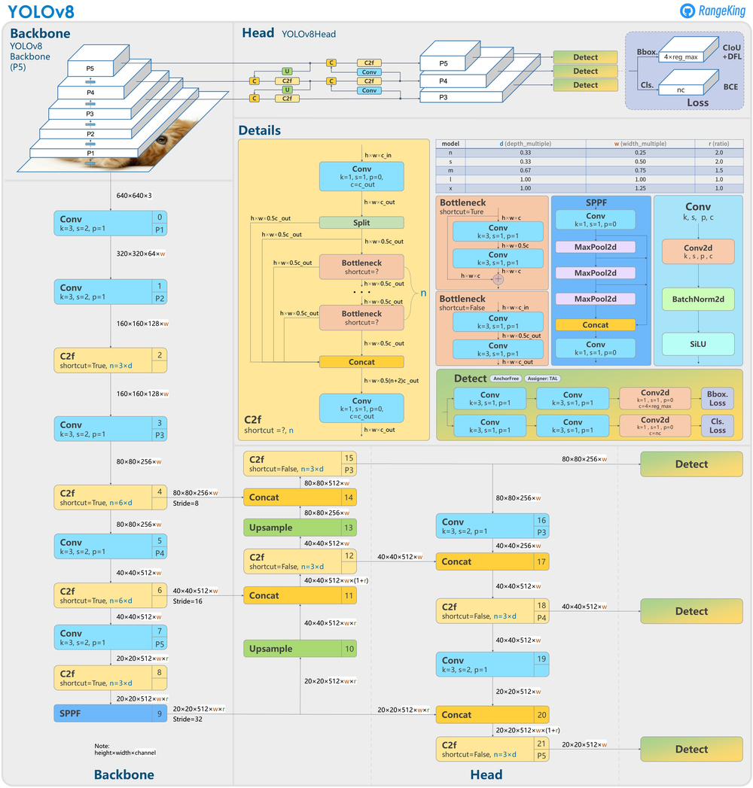

YOLOv8 的改进与创新有以下几点：

### 1. Head

Head 部分的变化最大，YOLOv5 采用耦合头（Coupled Head）和 Anchor Based 策略，YOLOv8 选择解耦头（Decoupled Head）和 Anchor Free 策略，不再有之前的 Objectness 分支，只有解耦的分类和回归分支。由于使用了 DFL 的思想，因此回归头的通道数也变成了 4 * reg_max 的形式。

众所周知，锚框是早期 YOLO 模型中的棘手部分，因为它们可能代表目标基准框的分布，而不是自定义数据集的分布。YOLOv8抛弃了以往的 Anchor Base，使用了 Anchor Free 的思想。所以，YOLOv8 是一个无锚模型，这意味着它直接预测对象的中心而不是已知锚框的偏移量。Anchor Free 检测减少了框预测的数量，从而加速了非最大抑制（NMS）。

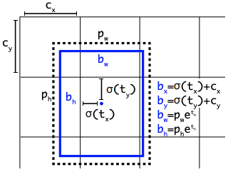

### 2. Backbone

YOLOv5 中的 C3 模块被替换成了 C2f 模块，就是参考了 C3 模块以及 ELAN 的思想进行的设计，实现了进一步的轻量化，还能获得更加丰富的梯度流信息，同时 YOLOv8 依旧使用了 YOLOv5 等模型中使用的 SPPF 模块。模块总结如下图所示，其中 “f” 是特征数量，“e” 是膨胀率，CBS 是由 Conv、BatchNorm 和 SiLU 组成的块。在 C2f 中，第一个 6 x 6 转换被 3 x 3 取代。在 C2f 中，所有输出（两个残差连接的 3 x 3 卷积）被连接起来，而在 C3 中，只使用最后一个输出。

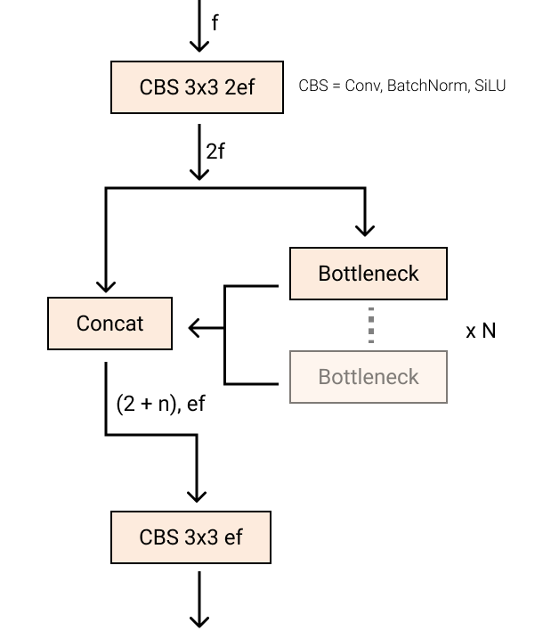

### 3. PAN FPN

YOLOv8 将 C3 模块和 RepBlock 替换为了 C2f 模块，同时 YOLOv8 选择将上采样之前的 1 × 1 卷积去除，将 Backbone 不同阶段输出的特征直接送入了上采样操作。

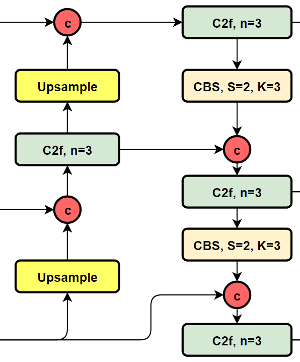

### 4. 损失函数

YOLOv8 的分类损失为 VFL Loss（[VarifocalNet: An IoU-aware Dense Object Detector](https://arxiv.org/abs/2008.13367)），回归损失为 CIOU Loss（[Generalized Focal Loss: Learning Qualified and Distributed Bounding Boxes for Dense Object Detection](https://arxiv.org/abs/2006.04388)） + DFL 的形式，Reg_max 默认为16。

$$
{\rm{DFL}}({S_i},{S_{i + 1}}) =  - (({y_{i + 1}} - y)\log ({S_i}) + (y - {y_i})\log ({S_{i + 1}}))
$$

### 5. 样本匹配

YOLOv8 抛弃了以往的 IOU 匹配或者单边比例的分配方式，而是使用了 Task Aligned Assigner 匹配方式。

为与 NMS 搭配，训练样例的 Anchor 分配需要满足以下两个规则：

1. 正常对齐的 Anchor 应当可以预测高分类得分，同时具有精确定位；
2. 不对齐的 Anchor 应当具有低分类得分，并在 NMS 阶段被抑制。基于上述两个目标，Task Aligned 设计了一个新的 Anchor alignment metric 来在 Anchor level 衡量Task Alignment 的水平。并且，Alignment metric 被集成在了 sample 分配和 loss function 里来动态的优化每个 Anchor 的预测。

Anchor alignment metric：

$$
t = {s^\alpha } \times {u^\beta }
$$

s 和 u 分别为分类得分和 IoU 值，α 和 β 为权重超参数。t 可以同时控制分类得分和 IoU 的优化来实现 Task Alignment，也可以引导网络动态的关注于高质量的Anchor。

## YOLOv8 训练

本文将使用 MSCOCO2017 数据集在 YOLOv8 上训练。

### 1. 安装环境

YOLOv8 需要 3.10 >= [**Python**](https://www.python.org/) >=3.7，[**PyTorch**](https://pytorch.org/get-started/locally/) >=1.7，本文使用 Python 3.8.10，PyTorch 1.11.0 + cu113。

本文运行环境为：Ubuntu 20.04 TLS，60 Cores，120 GB RAM，4 x NVIDIA A5000 24 GB

目前 YOLOv8 核心代码都封装在 [ultralytics](https://github.com/ultralytics/ultralytics) 这个依赖包里面，可以通过 pip（推荐）或 git clone 来安装。

```bash
pip install ultralytics
```

### 2. 数据集

首先，下载 [MSCOCO2017](http://images.cocodataset.org/) 数据集与 [COCO labels](https://github.com/ultralytics/yolov5/releases/download/v1.0/coco2017labels.zip)。

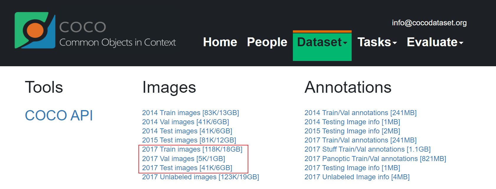

将 train2017.zip，test2017.zip，val2017.zip 解压至 images 下，coco2017labels.zip 解压至 labels 下，数据集目录应为：

```txt
coco2017
--iamges
----test2017
----train2017
----val2017
--labels
----test2017
----train2017
--test-dev2017.txt
--train2017.txt
--test2017.txt
```

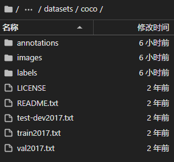

在你想要存放运行文件的目录下新建一个 coco.yaml，将 path 后的地址改为存放 MSCOCO 数据集的目录。

```yaml
path: /root/deep_learning/datasets/coco # dataset root dir
train: train2017.txt # train images (relative to 'path') 118287 images
val: val2017.txt # val images (relative to 'path') 5000 images
test: test-dev2017.txt # 20288 of 40670 images, submit to https://competitions.codalab.org/competitions/20794

# Classes
names:
  0: person
  1: bicycle
  2: car
  3: motorcycle
  4: airplane
  5: bus
  6: train
  7: truck
  8: boat
  9: traffic light
  10: fire hydrant
  11: stop sign
  12: parking meter
  13: bench
  14: bird
  15: cat
  16: dog
  17: horse
  18: sheep
  19: cow
  20: elephant
  21: bear
  22: zebra
  23: giraffe
  24: backpack
  25: umbrella
  26: handbag
  27: tie
  28: suitcase
  29: frisbee
  30: skis
  31: snowboard
  32: sports ball
  33: kite
  34: baseball bat
  35: baseball glove
  36: skateboard
  37: surfboard
  38: tennis racket
  39: bottle
  40: wine glass
  41: cup
  42: fork
  43: knife
  44: spoon
  45: bowl
  46: banana
  47: apple
  48: sandwich
  49: orange
  50: broccoli
  51: carrot
  52: hot dog
  53: pizza
  54: donut
  55: cake
  56: chair
  57: couch
  58: potted plant
  59: bed
  60: dining table
  61: toilet
  62: tv
  63: laptop
  64: mouse
  65: remote
  66: keyboard
  67: cell phone
  68: microwave
  69: oven
  70: toaster
  71: sink
  72: refrigerator
  73: book
  74: clock
  75: vase
  76: scissors
  77: teddy bear
  78: hair drier
  79: toothbrush
```

### 3. 下载预训练模型

在 YOLOv8 的 [GitHub](https://github.com/ultralytics/assets/releases) 网址上下载对应版本的预训练模型，若想从头开始训练，则可以定位到 site-packages/ultralytics/models/v8 下选择相应的 yaml 文件。

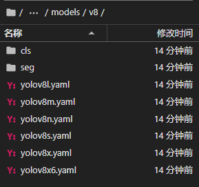

### 4. 训练

```bash
yolo task=detect mode=train model='' ...
```

task，mode 为必选参数，其他可选参数如下：

```python
model:  # path to model file, i.e. yolov8n.pt, yolov8n.yaml
data:  # path to data file, i.e. i.e. coco128.yaml
epochs: 100  # number of epochs to train for
patience: 50  # epochs to wait for no observable improvement for early stopping of training
batch: 16  # number of images per batch (-1 for AutoBatch)
imgsz: 640  # size of input images as integer or w,h
save: True  # save train checkpoints and predict results
cache: False  # True/ram, disk or False. Use cache for data loading
device:  # device to run on, i.e. cuda device=0 or device=0,1,2,3 or device=cpu
workers: 8  # number of worker threads for data loading (per RANK if DDP)
project:  # project name
name:  # experiment name
exist_ok: False  # whether to overwrite existing experiment
pretrained: False  # whether to use a pretrained model
optimizer: SGD  # optimizer to use, choices=['SGD', 'Adam', 'AdamW', 'RMSProp']
verbose: True  # whether to print verbose output
seed: 0  # random seed for reproducibility
deterministic: True  # whether to enable deterministic mode
single_cls: False  # train multi-class data as single-class
image_weights: False  # use weighted image selection for training
rect: False  # support rectangular training
cos_lr: False  # use cosine learning rate scheduler
close_mosaic: 10  # disable mosaic augmentation for final 10 epochs
resume: False  # resume training from last checkpoint
```

主要填写 ：

```python
model  # 预训练模型或初始模型路径
data  # 上文 coco.yaml 的路径
epochs  # 迭代轮数
batch  # 根据显存调节
device  # 调用显卡数量，如：0,1,2,3
workers  # 调用 cpu 核心数）
resume  # 是否为断点续训，若是，则需把 model 路径改为上次保存的 best.pt 的路径
```

例如：

```bash
yolo task=detect mode=train model=yolov8n.pt data=coco.yaml epochs=100 batch=256 device=0,1,2,3 workers=56 resume=False
```

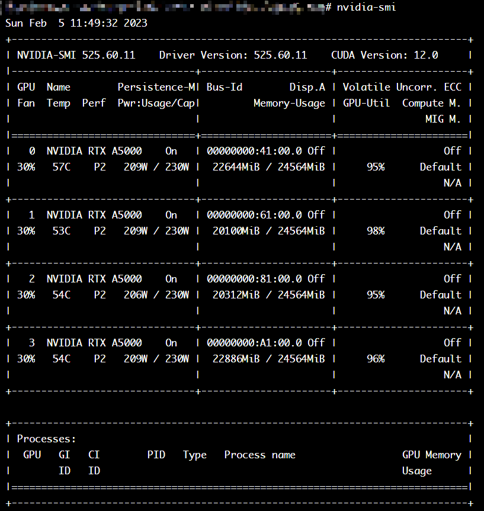

可以通过 Tensorboard 查看运行过程，将 {path} 改为 train 文件夹的绝对路径。

```bash
tensorboard --logdir={path}
```

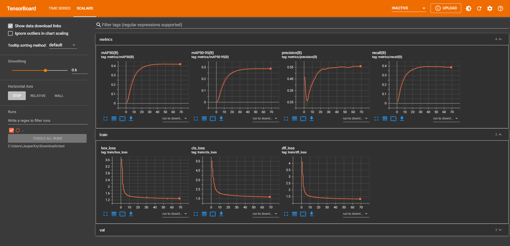

### 5. 导出模型

训练完成后，会在运行目录下的 runs/detect/train/weights 目录下生成 best.pt 文件，此文件为训练出的最好的模型文件。

## YOLOv8 测试

```bash
yolo task=detect mode=predict source=''...
```

task，mode 为必选参数，其他可选参数如下：

```python
source:  # source directory for images or videos
show: False  # show results if possible
save_txt: False  # save results as .txt file
save_conf: False  # save results with confidence scores
save_crop: False  # save cropped images with results
hide_labels: False  # hide labels
hide_conf: False  # hide confidence scores
vid_stride: 1  # video frame-rate stride
line_thickness: 3  # bounding box thickness (pixels)
visualize: False  # visualize model features
augment: False  # apply image augmentation to prediction sources
agnostic_nms: False  # class-agnostic NMS
classes:  # filter results by class, i.e. class=0, or class=[0,2,3]
retina_masks: False  # use high-resolution segmentation masks
boxes: True # Show boxes in segmentation predictions
```

主要填写：

```python
source  # 源文件路径，可以是图片或视频
show  # 是否展示图片或视频
classes  # 显示哪些类别，类别在上文的 coco.yaml 中列出
```

例如：

```bash
yolo predict model=yolov8n.pt source="https://ultralytics.com/images/bus.jpg" show classes=0
```

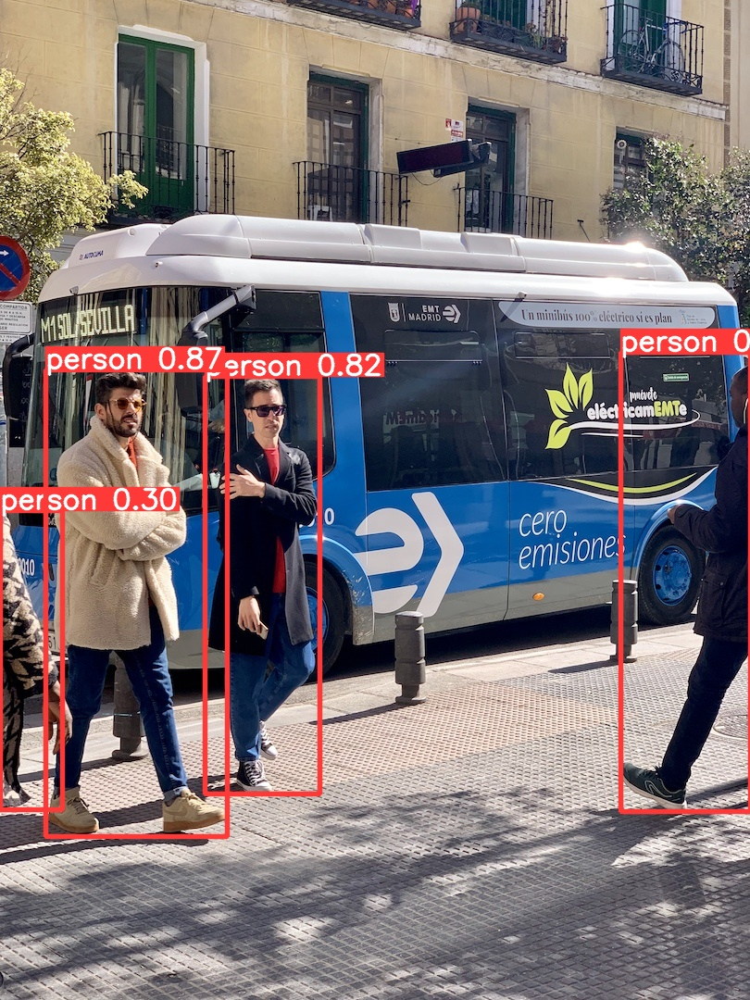

YOLOv8 也可以在 Python 中调用，详情可查看官方 [Docs](https://docs.ultralytics.com/)。

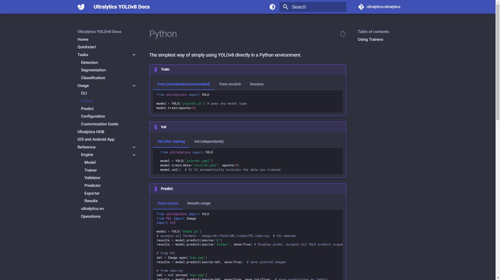
